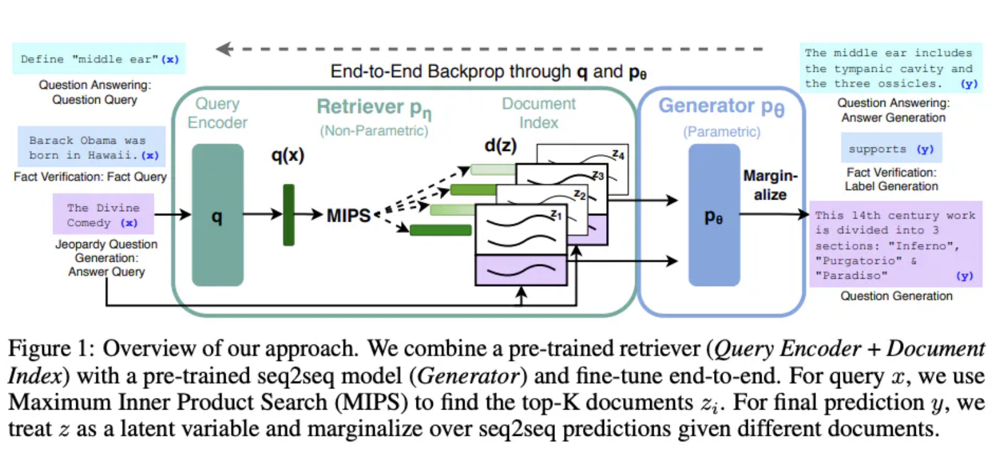
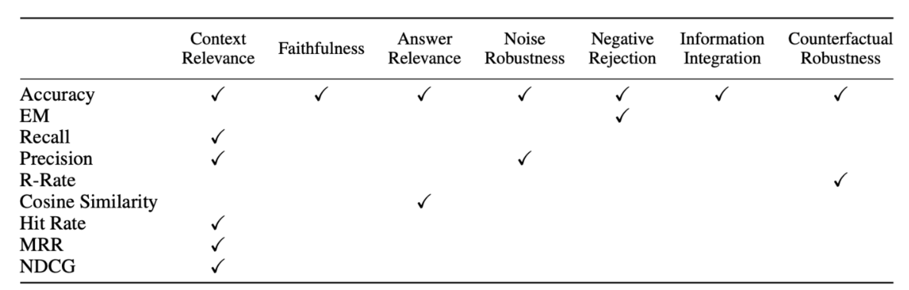
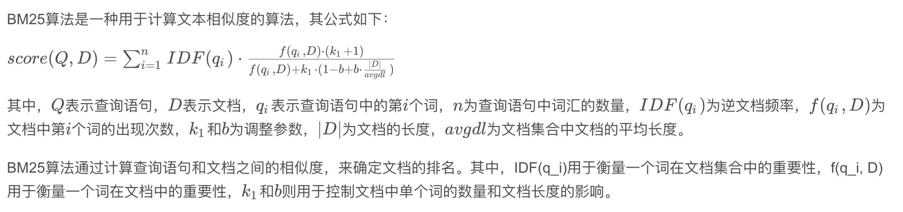
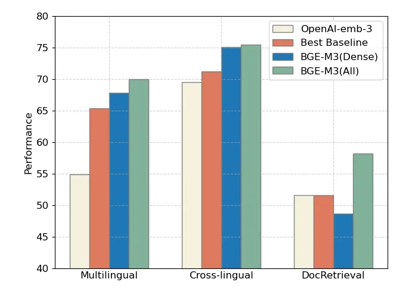
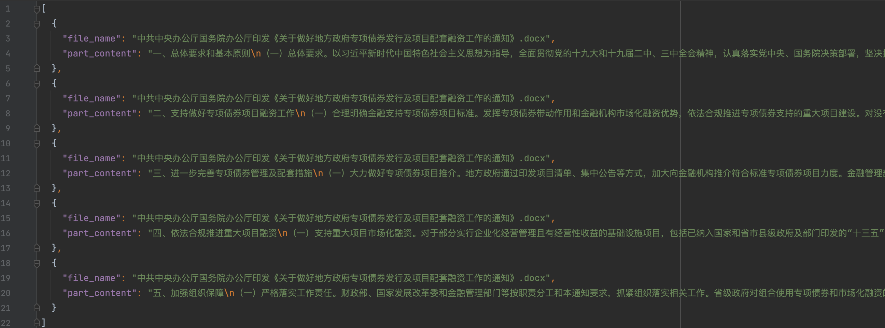
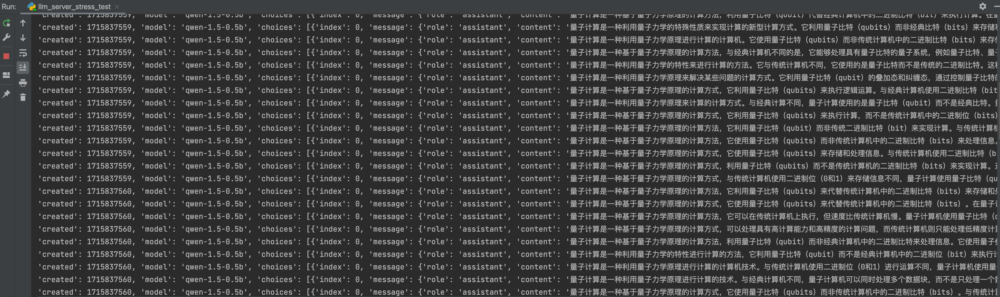

## 1. 检索增强生成

### 1.1 RAG基本介绍

#### 1.1.1 RAG是什么

开源的基座模型参数量不够大，本身拥有的能力有限。要完成复杂的知识密集型的任务，可以基于语言模型构建一个系统，通过访问外部知识源来做到。这样可以使生成的答案更可靠，有助于缓解“幻觉”问题。

RAG 会接受输入并检索出一组相关/支撑的文档，并给出文档的来源。这些文档作为上下文和输入的原始提示词组合，送给文本生成器得到最终的输出。这样 RAG 更加适应事实会随时间变化的情况，这非常有用，因为 LLM 的参数化知识是静态的，RAG 让语言模型不用重新训练就能够获取最新的信息，基于检索生成产生可靠的输出。


#### 1.1.2 RAG发展历程

“RAG”概念由Lewis在2020年引入，其发展迅速，标志着研究旅程中的不同阶段。最初，这项研究旨在通过在预训练阶段为它们注入额外知识来增强语言模型。ChatGPT的推出引发了对利用大型模型进行深度上下文理解的高度兴趣，加速了RAG在推断阶段的发展。随着研究人员更深入地探索大型语言模型（LLMs）的能力，焦点转向提升他们的可控性和推理技巧以跟上日益增长的需求。GPT-4 的出现标志着一个重要里程碑，它革新了 RAG ，采取一种将其与微调技术相结合的新方法，并继续优化预训练策略。


#### 1.1.3 RAG生态及挑战

RAG的应用已不再局限于问答系统，其影响力正在扩展到更多领域。现在，诸如推荐系统、信息提取和报告生成等各种任务开始从RAG技术的应用中受益。与此同时，RAG技术栈正在经历一次繁荣。除了众所周知的工具如Langchain和LlamaIndex外，市场上也出现了更多针对性强的RAG工具，例如：为满足更专注场景需求而定制化的；为进一步降低入门门槛而简化使用的；以及功能专业化、逐渐面向生产环境目标发展的。

RAG当前面临的挑战：

- 上下文长度：当检索到的内容过多并超出窗口限制时该怎么办？如果LLMs的上下文窗口不再受限，应如何改进RAG？
- 鲁棒性：如何处理检索到的错误内容？如何筛选和验证检索到的内容？如何增强模型对毒化和噪声的抵抗力？
- 与微调协同工作：如何同时利用RAG和FT的效果，它们应该如何协调、组织，是串行、交替还是端对端？
- 规模定律：RAG模型是否满足规模定律？会有什么情况下可能让RAG经历逆向规模定律现象呢？
- 生产环境应用：如何减少超大规模语料库的检索延迟? 如何确保被 LLMS 检索出来的内容不会泄露?

### 1.2 RAG技术实现

#### 1.2.1 RAG技术范式

在RAG的技术发展中，我们从技术范式的角度总结了其演变过程，主要分为以下几个阶段：

- 初级RAG：初级RAG主要包括三个基本步骤：1）索引——将文档语料库切分成更短的片段，并通过编码器建立向量索引。2）检索——根据问题和片段之间的相似性检索相关文档片段。3）生成——依赖于检索到的上下文来生成对问题的回答。
- 高级RAG：初级RAG在检索、生成和增强方面面临多重挑战。随后提出了高级RAG范式，涉及到预检索和后检索阶段额外处理。在检索之前，可以使用查询重写、路由以及扩展等方法来调整问题与文档片段之间语义差异。在检索之后，重新排列已获取到的文档语料库可以避免"迷失在中间"现象，或者可以过滤并压缩上下文以缩短窗口长度。
- 模块化RAG：随着RAG技术进一步发展和演变，模块化RAG的概念诞生了。结构上，它更自由灵活，引入更具体功能模块如查询搜索引擎以及多答案融合。技术层面上，它将信息查找与微调、强化学习等技术集成起来。在流程方面，RAG模块设计并协同工作形成各种不同类型RAG。

然而，模块化 RAG 并非突然出现，这三种范式存在继承与发展关系。高级RAG是模块化RAG的特殊情况，而初级RAG是高级RAG的特殊情况。


#### 1.2.2 RAG基本流程

基本流程概述：用户输入问题——>问题重构（补全指代信息，保证多轮对话的能力）——>从检索库检索答案——用LLM总结答案

RAG 由两部分组成：

- 第一部分负责在知识库中，根据 query 检索出匹配的文档。
- 第二部分将 query 和文档拼接起来作为 QA 的 prompt，送入 seq2seq 模型，生成回复。



#### 1.2.3 选择RAG还是微调

除了RAG之外，LLMs的主要优化策略还包括提示工程和微调（FT）。每种都有其独特的特点。根据它们对外部知识的依赖性以及对模型调整的需求，每种都有适合的应用场景。


RAG就像是给模型提供了一本定制信息检索的教科书，非常适合特定的查询。另一方面，FT就像一个学生随着时间内化知识，更适合模仿特定的结构、风格或格式。通过增强基础模型的知识、调整输出和教授复杂指令，FT可以提高模型的性能和效率。然而，它并不擅长整合新知识或快速迭代新用例。RAG和FT并不互斥，它们相辅相成，并且同时使用可能会产生最好的结果。


#### 1.2.4 如何评价RAG的效果

对RAG的评估方法多种多样，主要包括三个质量分数：上下文相关性、答案准确性和答案相关性。此外，评估还涉及四项关键能力：抗噪声能力、拒绝能力、信息整合以及反事实鲁棒性。这些评价维度将传统的定量指标与针对RAG特点的专门评估标准相结合，尽管这些标准尚未得到标准化。

在评价框架方面，有RGB和RECALL等基准测试，以及像RAGAS、ARES和TruLens等自动化评价工具，它们帮助全面衡量RAG模型的表现。



### 1.3 常见的信息检索算法

稠密检索（Dense Retrieval, DR）一般指的是将documents编码为稠密向量（Dense Vector），这个如今一般都通过预训练模型的encoder进行完成，例如BERT或者T5等（GPT这种decoder架构的也可以做到）。随后基于向量数据库（如FAISS）等进行类似于K近邻的搜索方法，来查找与查询内容接近的高维文档向量。【需要的空间大，查询速度快】

稀疏检索（Sparse Retrieval, SR）将文档投射到一个稀疏向量上，顾名思义，这个稀疏向量通常与文档的语言词汇一致，例如你的一篇文章，对每个词进行向量化，随后在词这个维度上进行执行你的检索策略。当然，这个传统的BM25或者TF-IDF也可以做到，但随着Transformer接管了这一领域，你会看到像 SPLADE 这样的方法，使用神经模型来推断与文档相关的词汇，即使这些词汇并不存在。这种方法的好处是，你可以离线处理文章中的词等细粒度的向量表示，从而大大加速检索的效率。【需要的空间小，查询速度慢】

#### 1.3.1 BM25检索

在信息检索领域，BM25算法被广泛认为是一种经典且有效的排名函数，用于估计文档与用户查询之间的相关性。BM25（Best Matching 25）是基于Okapi TF-IDF算法的改进版本，旨在解决一些Okapi算法存在的问题。BM25的核心思想是利用词频（TF）和逆文档频率（IDF）来衡量文档与查询之间的相关性，同时引入文档长度信息来进一步调整相关性的计算。

- 词频（TF）：词频是衡量一个词在文档中重要性的基本指标。在BM25算法中，词频是通过计算查询中的词在文档中出现的频率来确定的。词频越高，这个词在文档中的重要性越大。
- 逆文档频率（IDF）：逆文档频率用于衡量一个词在整个文档集合中的独特性或信息量。它是由整个文档集合中包含该词的文档数量决定的。一个词在很多文档中出现，其IDF值就会低，反之则高。这意味着罕见的词通常有更高的IDF值，从而在相关性评分中拥有更大的权重。
- 文档长度：除了词频和逆文档频率，BM25还引入了文档长度信息来调整相关性的计算。较长的文档可能仅因为它们的长度就有更高的词频，因此需要用文档长度来调整词频的影响。



#### 1.3.2 BGE检索

智源研究院发布了一款开源的中英文语义向量模型BGE（BAAI General Embedding），在中英文语义检索精度与整体语义表征能力方面全面超越了OpenAI、Meta等同类模型。BGE模型的发布，标志着语义向量模型（Embedding Model）在搜索、推荐、数据挖掘等领域的应用迈入了一个新的阶段。

- 项目地址：[https://github.com/FlagOpen/FlagEmbedding](https://github.com/FlagOpen/FlagEmbedding)
- 论文地址：[https://arxiv.org/pdf/2309.07597](https://arxiv.org/pdf/2309.07597)

BGE的技术亮点：

- 高效预训练和大规模文本微调；
- 在两个大规模语料集上采用了RetroMAE预训练算法，进一步增强了模型的语义表征能力；
- 通过负采样和难负样例挖掘，增强了语义向量的判别力；
- 借鉴Instruction Tuning的策略，增强了在多任务场景下的通用能力。



## 2. 实例场景及服务器环境

### 2.1 服务器测试环境

实验环境：实体GPU服务器，NVIDIA RTX 4090 / 24GB，CentOS 7.9，Anaconda3-2019.03，CUDA 12.4

如果没有GPU服务器，可以租用AutoDL等平台的。服务器的租用及基础环节的安装这里就不赘述了，详见我的另一篇博客：[常用深度学习平台的使用指南](https://www.eula.club/blogs/常用深度学习平台的使用指南.html)

### 2.2 实例场景及源码

实例场景概述：有一批内部的政府政策文档，数据不可外传，使用自部署的大模型来实现，需要基于这些文档进行垂直领域的问答。

本项目我已经在Github上进行了开源，项目地址为：[https://github.com/Logistic98/rag-omni](https://github.com/Logistic98/rag-omni)

```
.
├── README.md
├── data
│   ├── convert_data           // 转换处理数据的脚本
│   ├── original_data          // 原始文档数据
│   └── preprocess_data        // 处理后的结构化数据
├── llm
│   ├── llm_server.py          // 部署本地大模型服务
│   ├── llmtuner               // 部署本地大模型服务的核心代码
│   ├── models                 // 存放本地大模型的模型文件
│   └── test                   // 测试大模型服务的脚本
├── retrieval
│   ├── bge_retrieval          // BGE检索算法的核心代码
│   ├── bm25_retrieval         // BM25检索算法的核心代码
│   ├── code.py
│   ├── log.py
│   ├── response.py
│   ├── retrieval_server.py    // 部署检索服务
│   └── test                   // 测试检索服务的脚本
└── rag         
   ├── code.py
   ├── log.py
   ├── rag_server.py           // 部署RAG服务
   ├── rag_solve.py            // RAG处理逻辑的核心代码
   ├── response.py
   └── test                    // 测试RAG服务的脚本
```

### 2.3 原始数据预处理

#### 2.3.1 数据预处理要求

数据预处理：需要将数据预处理成结构化数据之后，才能方便的构建检索库。

- 数据预处理要求：每个文档拆开，拆开后每个数据是文档中的某一段，目的是保证每条数据都有较完整的语义，并且长度不会太长。
- 数据预处理方式：提供的文档主要是Word、PDF等格式，无法直接使用。数据量少的话，可以直接人工去处理。数据量大的话，建议先使用脚本批量处理一下，有些解析不成功的再人工处理。



#### 2.3.2 数据预处理脚本

PDF格式是非常难处理的，如果是文本类型的可以使用以下脚本来初步处理，如果本身就是图片类型的，那该脚本解析不了，就需要OCR技术来辅助了。关于复杂PDF文件的解析可以使用 Marker 库，详见我的另一篇博客：[PDF解析与基于LLM的本地知识库问答](https://www.eula.club/blogs/PDF解析与基于LLM的本地知识库问答.html)

./rag-omni/data/convert_data/pdf_to_docx.py

```python
# -*- coding: utf-8 -*-

import os
from pdf2docx import Converter
import argparse

parser = argparse.ArgumentParser(description="服务调用方法：python3 pdf_to_docx.py --pdf_path 'xxx.pdf' --docx_path 'xxx.docx'")
parser.add_argument("--pdf_path", type=str, required=True, help="要解析的 PDF 文件地址")
parser.add_argument("--docx_path", type=str, required=True, help="解析后的 DOCX 文件输出地址")
args = parser.parse_args()

docx_dir = os.path.dirname(args.docx_path)
if not os.path.exists(docx_dir):
    os.makedirs(docx_dir)

try:
    # 初始化转换器并转换 PDF 到 DOCX
    cv = Converter(args.pdf_path)
    cv.convert(args.docx_path)  # 默认转换所有页面
    cv.close()
    print("PDF 文件已成功转换为 DOCX 格式。")
except Exception as e:
    print(f"转换过程中发生错误：{str(e)}")
```

./rag-omni/data/convert_data/docx_to_json.py

```python
# -*- coding: utf-8 -*-

import os
from docx import Document
import json
import argparse

parser = argparse.ArgumentParser(description="服务调用方法：python3 docx_to_json.py --docx_path 'xxx.docx' --output_path 'xxx.json' --max_length 500")
parser.add_argument("--docx_path", type=str, required=True, help="docx 文件地址")
parser.add_argument("--output_path", type=str, required=True, help="结果输出地址")
parser.add_argument("--max_length", default=500, type=int, help="切片大小")
args = parser.parse_args()

docx = Document(args.docx_path)
max_length = args.max_length

result = []
current_text = ""

for paragraph in docx.paragraphs:
    section = paragraph.text.strip()
    if not current_text or len(current_text) + len(section) + 1 <= max_length:
        current_text += " " + section
    else:
        result.append({
            "file_name": os.path.basename(args.docx_path),
            "part_content": current_text.strip()
        })
        current_text = section

if current_text:
    result.append({
        "file_name": os.path.basename(args.docx_path),
        "part_content": current_text.strip()
    })

output_dir = os.path.dirname(args.output_path)
if not os.path.exists(output_dir):
    os.makedirs(output_dir)

with open(args.output_path, "w", encoding="utf-8") as file:
    json.dump(result, file, ensure_ascii=False, indent=2)

print(f"{args.docx_path} 处理完成")
```

## 3. 部署大模型服务

后面的检索服务和RAG服务，对接了 OpenAI 风格的 API，可以使用任意符合该格式的服务。如果有数据保密、本地化部署的需求，可以使用本地化部署的大模型服务。如果直接使用外部的API，本节可跳过。

### 3.1 LLaMA-Factory的推理服务

这里用了 [LLaMA-Factory](https://github.com/hiyouga/LLaMA-Factory) 项目的 /src/llmtuner 部分，它支持了 vLLM，对推理进行了加速，本项目代码里用的版本需要要求 vllm==0.4.0 版本。

```
llm
├── llm_server.py
├── llmtuner
│   ├── api
│   ├── chat
│   ├── data
│   ├── extras
│   ├── hparams
│   └── model
├── models
│   ├── download_baichuan_model.py
│   └── download_qwen_model.py
└── test
    ├── llm_server_stress_test.py
    └── llm_server_test.py
```

注：开启vLLM可以充分利用显卡计算资源，带来更好的推理性能，详见我的另一篇博客：[基于vLLM加速大模型推理服务](https://www.eula.club/blogs/基于vLLM加速大模型推理服务.html)

### 3.2 部署大模型服务并进行测试

Step1：下载Qwen1.5-0.5B大模型

models文件夹提供了 Qwen、Baichuan 模型的下载脚本（不仅限于这些，模型的支持情况详见 LLaMA-Factory 项目），这里使用 Qwen1.5-0.5B 进行实验。

```python
# -*- coding: utf-8 -*-

import os
from huggingface_hub import snapshot_download

# 设置代理
# os.environ['http_proxy'] = 'http://127.0.0.1:7890'
# os.environ['https_proxy'] = 'http://127.0.0.1:7890'

# 模型仓库的标识
repo_id = "Qwen/Qwen1.5-0.5B"

# 下载模型到指定目录
local_dir = "./Qwen1.5-0.5B"

# 检查目录是否存在，如果不存在则创建
if not os.path.exists(local_dir):
    os.makedirs(local_dir)

snapshot_download(repo_id=repo_id, local_dir=local_dir)
```

Step2：启动Qwen大模型服务

```shell
$ cd ./llm
$ CUDA_VISIBLE_DEVICES=0 python3 llm_server.py \
    --model_name_or_path ./models/Qwen1.5-0.5B \
    --template default \
    --infer_backend vllm
```

启动之后，使用浏览器打开此地址：`http://<your_server_ip>:5000/docs `，可以访问到接口文档。

Step3：测试Qwen大模型服务

执行 ./rag-omni/llm/test/llm_server_test.py 脚本即可进行测试。

```python
# -*- coding: utf-8 -*-

import json
import requests


def send_post_request(url, payload):
    """
    向指定的URL发送POST请求。
    """
    headers = {
        "accept": "application/json",
        "Content-Type": "application/json"
    }

    updated_payload = {
        "model": "qwen-1.5-0.5b",
        "messages": [
            {
                "role": "user",
                "content": payload["prompt"]
            }
        ],
        "tools": [
            {
                "type": "function",
                "function": {
                    "name": "string",
                    "description": "string",
                    "parameters": {}
                }
            }
        ],
        "temperature": 0,
        "top_p": 0,
        "n": 1,
        "max_tokens": 0,
        "stream": False
    }

    response = requests.post(url, headers=headers, data=json.dumps(updated_payload))
    try:
        response_json = response.json()
        print(response_json)
    except ValueError:
        print("Response could not be decoded as JSON:", response.text)


if __name__ == '__main__':
    api_url = 'http://127.0.0.1:5000/v1/chat/completions'
    payload = {
        "prompt": "解释一下量子计算"
    }
    send_post_request(api_url, payload)
```

它的请求与返回格式都是标准 OpenAI API 形式。

```json
{
    'id': 'chatcmpl-987741d7e7f049dd864b7fae170d36e1',
    'object': 'chat.completion',
    'created': 1715835635,
    'model': 'qwen-1.5-0.5b',
    'choices': [
        {
            'index': 0,
            'message': {
                'role': 'assistant',
                'content': '量子计算是一种利用量子力学原理进行计算的计算机技术。与经典计算机使用二进制位（0和1）进行计算不同，量子计算机使用量子比特（qubit）进行计算。这种量子比特可以同时处于0和1的状态，而传统计算机只能在0和1之间进行比较和计算。量子计算的优点包括量子纠错和量子计算速度的提高，这些都使得它在许多领域，如模拟和预测、加密和加密、模拟和模拟、模拟和模拟、模拟和模拟等方面具有潜力。\n量子计算与经典计算机相比有许多显著的优势，例如：\n1.量子纠错：量子计算机可以对输入数据进行更加精确的计算，因为它可以同时计算出多个状态，从而避免了传统计算机中的错误。\n2.量子计算速度的提高：由于量子比特可以同时处于0和1的状态，因此量子计算机的计算速度比经典计算机更快。\n3.量子纠错和量子计算速度的提高：量子计算机可以对输入数据进行更加精确的计算，因为它可以同时计算出多个状态，从而避免了传统计算机中的错误。\n4.量子纠错和量子计算速度的提高：量子计算机可以对输入数据进行更加精确的计算，因为它可以同时计算出多个状态，从而避免了传统计算机中的错误。\n因此，量子计算是一种非常有前途的计算机技术，具有许多优势，例如量子纠错、量子计算速度的提高、量子纠错和量子计算速度的提高等。',
                'tool_calls': None
            },
            'finish_reason': 'stop'
        }
    ],
    'usage': {
        'prompt_tokens': 12,
        'completion_tokens': 302,
        'total_tokens': 314
    }
}
```

注：执行 ./rag-omni/llm/test/llm_server_stress_test.py 脚本即可进行压力测试。



## 4. 部署检索服务

### 4.1 检索算法的实现

#### 4.1.1 BM25检索算法

BM25算法较为简单，这里就直接实现了。没将索引文件持久化，直接就加载内存里了。除此之外，BM25为ES默认的相关性排序算法，也可以借助ES去实现。

./rag-omni/retrieval/bm25_retrieval/bm25.py

```python
# -*- coding: utf-8 -*-

import math
import os
import jieba
import logging
import json

jieba.setLogLevel(log_level=logging.INFO)


class BM25Param(object):
    def __init__(self, f, df, idf, length, avg_length, docs_list, line_length_list, k1=1.5, k2=1.0, b=0.75):
        self.f = f
        self.df = df
        self.k1 = k1
        self.k2 = k2
        self.b = b
        self.idf = idf
        self.length = length
        self.avg_length = avg_length
        self.docs_list = docs_list
        self.line_length_list = line_length_list

    def __str__(self):
        return f"k1:{self.k1}, k2:{self.k2}, b:{self.b}"


class BM25Algorithm(object):
    current_dir = os.path.dirname(os.path.abspath(__file__))
    _stop_words_path = os.path.join(current_dir, 'stop_words.txt')
    _stop_words = []

    def __init__(self, file_paths):
        self.file_paths = file_paths
        self.param: BM25Param = self._load_param()

    def _load_stop_words(self):
        if not os.path.exists(self._stop_words_path):
            raise Exception(f"system stop words: {self._stop_words_path} not found")
        stop_words = []
        with open(self._stop_words_path, 'r', encoding='utf8') as reader:
            for line in reader:
                line = line.strip()
                stop_words.append(line)
        return stop_words

    def _build_param(self):
        def _cal_param(docs_data):
            f = []
            df = {}
            idf = {}
            length = len(docs_data)
            words_count = 0
            docs_list = []
            line_length_list = []
            for doc in docs_data:
                content = doc.get("part_content", "").strip()
                if not content:
                    continue
                words = [word for word in jieba.lcut(content) if word and word not in self._stop_words]
                line_length_list.append(len(words))
                docs_list.append(doc)
                words_count += len(words)
                tmp_dict = {}
                for word in words:
                    tmp_dict[word] = tmp_dict.get(word, 0) + 1
                f.append(tmp_dict)
                for word in tmp_dict.keys():
                    df[word] = df.get(word, 0) + 1
            for word, num in df.items():
                idf[word] = math.log((length - num + 0.5) / (num + 0.5) + 1)
            param = BM25Param(f, df, idf, length, words_count / length, docs_list, line_length_list)
            return param

        docs_data = []
        for file_path in self.file_paths:
            if not os.path.exists(file_path):
                raise Exception(f"input docs {file_path} not found")
            with open(file_path, 'r', encoding='utf8') as reader:
                docs = json.load(reader)
                for doc in docs:
                    doc["file_path"] = file_path
                docs_data.extend(docs)

        param = _cal_param(docs_data)
        return param

    def _load_param(self):
        self._stop_words = self._load_stop_words()
        param = self._build_param()
        return param

    def _cal_similarity(self, words, index):
        score = 0
        for word in words:
            if word not in self.param.f[index]:
                continue
            molecular = self.param.idf[word] * self.param.f[index][word] * (self.param.k1 + 1)
            denominator = self.param.f[index][word] + self.param.k1 * (1 - self.param.b +
                                                                       self.param.b * self.param.line_length_list[
                                                                           index] /
                                                                       self.param.avg_length)
            score += molecular / denominator
        return score

    def search(self, query: str, top_k: int = -1):
        if top_k != -1 and top_k <= 0:
            raise ValueError("top_k should be -1 or a positive integer")

        words = [word for word in jieba.lcut(query) if word and word not in self._stop_words]
        score_list = []
        for index in range(self.param.length):
            score = self._cal_similarity(words, index)
            score_list.append((self.param.docs_list[index], score))

        score_list.sort(key=lambda x: -x[1])
        if top_k != -1:
            score_list = score_list[:top_k]

        formatted_result = [
            {
                "file_name": os.path.basename(doc["file_path"]).replace('.json', '.docx'),
                "part_content": doc["part_content"],
                "score": score
            }
            for doc, score in score_list
        ]
        return formatted_result


if __name__ == '__main__':
    file_paths = [
        "../../data/preprocess_data/国务院关于加强地方政府性债务管理的意见.json",
        "../../data/preprocess_data/中共中央办公厅国务院办公厅印发《关于做好地方政府专项债券发行及项目配套融资工作的通知》.json"
    ]
    bm25 = BM25Algorithm(file_paths)
    query_content = "国务院对于地方政府性债务管理的意见"
    top_k = 5  # 可以设置为任意正整数，或者-1表示不限制
    result = bm25.search(query_content, top_k)
    print(json.dumps(result, ensure_ascii=False, indent=4))
```

注：代码中会用到 stop_words.txt 文件，已经放到项目里了，这里就不展示了。

#### 4.1.2 BGE检索算法

BGE向量检索需要下载 BAAI/bge-large-zh-v1.5 模型文件，项目里提供了模型下载脚本。没将索引文件持久化，直接就加载内存里了。

./rag-omni/retrieval/bge_retrieval/bge.py

```python
# -*- coding: utf-8 -*-

import os
import faiss
import json
import numpy as np
from tqdm import trange
from transformers import AutoTokenizer, AutoModel
import torch


class BGEAlgorithm:
    def __init__(self, file_paths):
        current_dir = os.path.dirname(os.path.abspath(__file__))
        self.model_path = os.path.join(current_dir, 'bge-large-zh-v1.5')
        self.tokenizer = AutoTokenizer.from_pretrained(self.model_path)
        self.model = AutoModel.from_pretrained(self.model_path)
        self.data_list = self.load_data(file_paths)
        self.embeddings_list = self.generate_embeddings()
        self.faiss_index = self.build_faiss_index()

    def load_data(self, file_paths):
        """读取数据文件并生成嵌入"""
        data_list = []
        for file_path in file_paths:
            with open(file_path, "r", encoding="utf-8") as f:
                data = json.load(f)
            for item in data:
                item['file_path'] = file_path
                data_list.append(item)
        return data_list

    def generate_embeddings(self):
        """生成嵌入"""
        embeddings_list = []
        batch_size = 32
        for i in trange(0, len(self.data_list), batch_size):
            batch_texts = [item['part_content'] for item in self.data_list[i:i + batch_size]]
            inputs = self.tokenizer(batch_texts, return_tensors='pt', padding=True, truncation=True, max_length=512)
            with torch.no_grad():
                outputs = self.model(**inputs)
            embeddings = outputs.last_hidden_state.mean(dim=1).cpu().numpy()
            embeddings_list.extend(embeddings)
        return embeddings_list

    def build_faiss_index(self):
        """构建Faiss索引"""
        doc_embeddings = np.array(self.embeddings_list)
        faiss_index = faiss.IndexFlatIP(doc_embeddings.shape[1])
        faiss_index.add(doc_embeddings)
        return faiss_index

    def search(self, query, top_k=-1):
        """检索函数"""
        inputs = self.tokenizer(query, return_tensors='pt', padding=True, truncation=True, max_length=512)
        with torch.no_grad():
            outputs = self.model(**inputs)
        query_emb = outputs.last_hidden_state.mean(dim=1).cpu().numpy()
        if top_k == -1:
            top_k = len(self.data_list)
        score, rank = self.faiss_index.search(query_emb, top_k)
        rank = rank[0]
        score = score[0]
        results = [
            {
                "file_name": os.path.basename(self.data_list[rank[i]]["file_path"]).replace('.json', '.docx'),
                "part_content": self.data_list[rank[i]]["part_content"],
                "score": float(score[i])
            }
            for i in range(top_k)
        ]
        return results


if __name__ == '__main__':
    file_paths = [
        "../../data/preprocess_data/国务院关于加强地方政府性债务管理的意见.json",
        "../../data/preprocess_data/中共中央办公厅国务院办公厅印发《关于做好地方政府专项债券发行及项目配套融资工作的通知》.json"
    ]
    query_text = "国务院对于地方政府性债务管理的意见"
    top_k = 5  # 可以设置为任意正整数，或者-1表示不限制
    bge = BGEAlgorithm(file_paths)
    results = bge.search(query_text, top_k)
    print(json.dumps(results, ensure_ascii=False, indent=4))
```

注：代码中会用到 bge-large-zh-v1.5 模型文件，这个没放到项目里，可以使用 ./rag-omni/retrieval/bge_retrieval/download_bge_model.py 脚本进行下载

```python
# -*- coding: utf-8 -*-

import os
from transformers import AutoTokenizer, AutoModel
from transformers.utils import logging

# 设置代理
# os.environ['http_proxy'] = 'http://127.0.0.1:7890'
# os.environ['https_proxy'] = 'http://127.0.0.1:7890'

# 配置 transformers 日志
logging.set_verbosity_info()


def download_and_save_model(model_name, save_directory):
    # 下载模型和分词器
    tokenizer = AutoTokenizer.from_pretrained(model_name)
    model = AutoModel.from_pretrained(model_name)
    # 保存模型和分词器
    tokenizer.save_pretrained(save_directory)
    model.save_pretrained(save_directory)
    print(f"模型和分词器已保存到 {save_directory}")


if __name__ == '__main__':
    model_name = 'BAAI/bge-large-zh-v1.5'
    save_directory = './bge-large-zh-v1.5'
    download_and_save_model(model_name, save_directory)
```

### 4.2 部署检索服务

#### 4.2.1 封装检索服务

这里使用 Flask 框架将 BM25、BGE检索算法封装成一个服务（log.py、response.py、code.py此处省略）。启动时需要传入知识库文件路径（json_files）、检索算法（algorithm）、服务端口号（port），/api/rag/retrieval 接口入参接受输入问题（question）和检索条数（top_k）。

./rag-omni/retrieval/retrieval_server.py

```python
# -*- coding: utf-8 -*-

import argparse
import json
from flask import Flask, jsonify
from flask_cors import CORS
from pre_request import pre, Rule

from log import logger
from response import ResponseCode, ResponseMessage
from bm25_retrieval.bm25 import BM25Algorithm
from bge_retrieval.bge import BGEAlgorithm

# 解析启动参数
parser = argparse.ArgumentParser(description="启动参数")
parser.add_argument('--json_files', type=str, required=True, help="JSON文件路径，多个用逗号分隔")
parser.add_argument('--algorithm', type=str, choices=['BM25', 'BGE'], required=True, help="检索算法：目前仅支持BM25或BGE")
parser.add_argument('--port', type=int, default=5001, help="启动的端口号，默认5001")
args = parser.parse_args()

json_file_paths = args.json_files.split(',')
retrieval_algorithm = args.algorithm
port = args.port

# 创建一个服务
app = Flask(__name__)
CORS(app, supports_credentials=True)

# 加载JSON文件内容到内存中
documents = []
for path in json_file_paths:
    with open(path, 'r', encoding='utf-8') as file:
        documents.extend(json.load(file))

# 初始化检索算法
if retrieval_algorithm == 'BM25':
    search_engine = BM25Algorithm(json_file_paths)
elif retrieval_algorithm == 'BGE':
    search_engine = BGEAlgorithm(json_file_paths)
else:
    raise ValueError("Unsupported retrieval algorithm")

"""
# 检索算法服务
"""
@app.route(rule='/api/rag/retrieval', methods=['GET'])
def retrieval():

    # 参数校验
    rule = {
        "question": Rule(type=str, required=True),
        "top_k": Rule(type=int, required=True, gte=-1, custom=lambda x: x == -1 or x > 0)
    }
    try:
        params = pre.parse(rule=rule)
    except Exception as e:
        logger.error(e)
        fail_response = dict(code=ResponseCode.PARAM_FAIL, msg=ResponseMessage.PARAM_FAIL, data=None)
        logger.error(fail_response)
        response = jsonify(fail_response)
        response.data = json.dumps(fail_response, ensure_ascii=False, indent=4)
        return response

    # 获取参数
    question = params.get("question")
    top_k = params.get("top_k")

    # 业务处理模块
    results = search_engine.search(question, top_k)

    # 成功的结果返回，格式化JSON
    success_response = dict(code=ResponseCode.SUCCESS, msg=ResponseMessage.SUCCESS, data=results)
    logger.info(success_response)
    response = jsonify(success_response)
    response.data = json.dumps(success_response, ensure_ascii=False, indent=4)
    return response


if __name__ == '__main__':
    # 解决中文乱码问题
    app.config['JSON_AS_ASCII'] = False
    # 启动服务，指定主机和端口
    app.run(host='0.0.0.0', port=port, debug=False, threaded=True)
```

#### 4.2.2 启动检索服务并测试

启动检索服务，这里以BM25算法为例，如果要使用 BGE 算法，则修改 --algorithm 传参为 BGE 即可。

```shell
$ cd ./retrieval
$ python3 retrieval_server.py --json_files "../data/preprocess_data/国务院关于加强地方政府性债务管理的意见.json,../data/preprocess_data/中共中央办公厅国务院办公厅印发《关于做好地方政府专项债券发行及项目配套融资工作的通知》.json" --algorithm BM25 --port 5001
```

./rag-omni/retrieval/test/retrieval_test.py 可用来测试检索服务

```PYTHON
# -*- coding: utf-8 -*-

import requests


def retrieval_test():
    url = 'http://{0}:{1}/api/rag/retrieval'.format("127.0.0.1", "5001")
    params = {'question': "国务院对于地方政府性债务管理的意见", 'top_k': 3}
    r = requests.get(url, params=params)
    print(r.text)


if __name__ == '__main__':
    retrieval_test()
```

输出top_k条数据记录，得分降序排列，返回值格式如下：


## 5. 部署RAG服务

### 5.1 封装RAG服务

这里使用 Flask 框架将RAG封装成一个服务（log.py、response.py、code.py此处省略）。启动时需要传入大模型服务地址（api_url）、大模型服务密钥（api_key）、大模型型号（model）、服务端口号（port）、检索服务地址（retrieval_url），/api/rag/summary 接口入参接受输入问题（content）和检索标识（id）。

./rag-omni/rag/rag_server.py

```python
# -*- coding: utf-8 -*-

import argparse
import json
import time
from flask import Flask, jsonify
from flask_cors import CORS
from pre_request import Rule, pre

from rag_solve import LLMService, History, get_knowledge_based_answer
from response import ResponseCode, ResponseMessage
from log import logger

# 解析启动参数
parser = argparse.ArgumentParser(description="启动参数")
parser.add_argument('--api_url', type=str, default="https://api.openai.com/v1/chat/completions", help="LLM API URL")
parser.add_argument('--api_key', type=str, help="LLM API Key")
parser.add_argument('--model', type=str, help="LLM模型名称")
parser.add_argument('--port', type=int, default=5002, help="启动的端口号，默认5002")
parser.add_argument('--retrieval_url', type=str, default="http://127.0.0.1:5001/api/rag/retrieval", help="检索服务的URL")
args = parser.parse_args()

# 初始化参数
api_url = args.api_url
api_key = args.api_key
model = args.model
port = args.port
retrieval_url = args.retrieval_url

# 初始化LLM服务
llm = LLMService(url=api_url, api_key=api_key, model=model)

# 初始化历史消息
session_histories = {}

# 创建一个服务
app = Flask(__name__)
CORS(app, supports_credentials=True)

"""
# 基于RAG的LLM对话服务
"""
@app.route("/api/rag/summary", methods=["POST"])
def get_bot_response():
    global session_histories, llm

    # 获取请求数据
    rule = {
        "content": Rule(type=str, required=True),
        "id": Rule(type=str, required=True)
    }
    try:
        params = pre.parse(rule=rule)
    except Exception as e:
        logger.error(e)
        fail_response = dict(code=ResponseCode.PARAM_FAIL, msg=ResponseMessage.PARAM_FAIL, data=None)
        logger.error(fail_response)
        response = jsonify(fail_response)
        response.data = json.dumps(fail_response, ensure_ascii=False, indent=4)
        return response

    userText = params["content"]
    session_id = params["id"]

    # 获取对话历史，如果有的话
    if session_id in session_histories:
        history_obj = session_histories[session_id]["history"]
        session_histories[session_id]["last_access_time"] = time.time()
    else:
        history_obj = History()
        session_histories[session_id] = {
            "history": history_obj,
            "last_access_time": time.time(),
        }

    # 如果用户超过一个小时没有交互，则删除该用户的对话历史
    max_idle_time = 60 * 60
    for sid, session_data in session_histories.copy().items():
        idle_time = time.time() - session_data["last_access_time"]
        if idle_time > max_idle_time:
            del session_histories[sid]

    # 清空对话历史
    if userText == "$清空对话历史":
        history_obj.history = []
        success_response = dict(code=ResponseCode.SUCCESS, msg=ResponseMessage.SUCCESS, data="已清空对话历史")
        logger.info(success_response)
        response = jsonify(success_response)
        response.data = json.dumps(success_response, ensure_ascii=False, indent=4)
        return response

    # 获取知识库回答
    try:
        answer = get_knowledge_based_answer(
            query=userText, history_obj=history_obj, url_retrieval=retrieval_url, llm=llm
        )
        success_response = dict(code=ResponseCode.SUCCESS, msg=ResponseMessage.SUCCESS, data=answer)
        logger.info(success_response)
        response = jsonify(success_response)
        response.data = json.dumps(success_response, ensure_ascii=False, indent=4)
        return response
    except Exception as e:
        logger.error(e)
        fail_response = dict(code=ResponseCode.BUSINESS_FAIL, msg=ResponseMessage.BUSINESS_FAIL, data=None)
        logger.error(fail_response)
        response = jsonify(fail_response)
        response.data = json.dumps(fail_response, ensure_ascii=False, indent=4)
        return response


if __name__ == '__main__':
    # 解决中文乱码问题
    app.config['JSON_AS_ASCII'] = False
    # 启动服务，指定主机和端口
    app.run(host='0.0.0.0', port=port, debug=False, threaded=True)
```

./rag-omni/rag/rag_solve.py

```python
# -*- coding: utf-8 -*-

import requests
import json
import os
import logging
from time import sleep

# 全局参数
RETRIEVAL_TOP_K = 5
LLM_HISTORY_LEN = 30

logging.basicConfig(level=logging.INFO)


class LLMService:
    def __init__(self, url, api_key, model):
        self.url = url
        self.headers = {
            "Authorization": f"Bearer {api_key}",
            "Content-Type": "application/json"
        }
        self.model = model

    def __call__(self, messages: list) -> str:
        data = {
            "model": self.model,
            "messages": messages
        }
        response = requests.post(self.url, headers=self.headers, json=data)
        response.raise_for_status()
        return response.json()["choices"][0]["message"]["content"]


class History:
    def __init__(self):
        self.history = []


def get_docs(question: str, url: str, top_k=RETRIEVAL_TOP_K, retries=3):
    params = {"question": question, "top_k": top_k}
    for attempt in range(retries):
        try:
            response = requests.get(url, params=params)
            response.raise_for_status()
            docs_response = response.json()
            # 提取实际的文档数据
            docs = [doc["part_content"] for doc in docs_response["data"]]
            return docs
        except Exception as e:
            logging.error(f"Error in get_docs: {e}")
            logging.error(f"Response content: {response.content.decode('utf-8')}")
            if attempt < retries - 1:
                sleep(2 ** attempt)
            else:
                raise


def get_knowledge_based_answer(query, history_obj, url_retrieval, llm):
    global RETRIEVAL_TOP_K

    if len(history_obj.history) > LLM_HISTORY_LEN:
        history_obj.history = history_obj.history[-LLM_HISTORY_LEN:]

    # 重构问题
    if len(history_obj.history):
        rewrite_question_input = history_obj.history.copy()
        rewrite_question_input.append(
            {
                "role": "user",
                "content": f"""请基于对话历史，对后续问题进行补全重构，如果后续问题与历史相关，你必须结合语境将代词替换为相应的指代内容，让它的提问更加明确；否则直接返回原始的后续问题。
                注意：请不要对后续问题做任何回答和解释。

                后续问题：{query}

                修改后的后续问题："""
            }
        )
        new_query = llm(rewrite_question_input)
    else:
        new_query = query

    # 获取相关文档
    docs = get_docs(new_query, url_retrieval, RETRIEVAL_TOP_K)
    doc_string = ""
    for i, doc in enumerate(docs):
        doc_string = doc_string + json.dumps(doc, ensure_ascii=False) + "\n"
    history_obj.history.append(
        {
            "role": "user",
            "content": f"请基于参考，回答问题，并给出参考依据：\n问题：\n{query}\n参考：\n{doc_string}\n答案："
        }
    )

    # 调用大模型获取回复
    response = llm(history_obj.history)

    # 修改history，将之前的参考资料从history删除，避免history太长
    history_obj.history[-1] = {"role": "user", "content": query}
    history_obj.history.append({"role": "assistant", "content": response})

    # 指定history.json的路径
    current_dir = os.path.dirname(os.path.abspath(__file__))
    history_file_path = os.path.join(current_dir, 'history.json')

    # 检查history.json是否存在，如果不存在则创建
    if not os.path.exists(history_file_path):
        with open(history_file_path, "w", encoding="utf-8") as file:
            json.dump([], file, ensure_ascii=False, indent=2)

    # 读取现有数据，追加新数据，并写回文件
    with open(history_file_path, "r", encoding="utf-8") as file:
        data = json.load(file)
    data.append({"query": query, "new_query": new_query, "docs": docs, "response": response})
    with open(history_file_path, "w", encoding="utf-8") as file:
        json.dump(data, file, ensure_ascii=False, indent=2)

    return {"response": response, "docs": docs}
```

### 5.2 启动RAG服务并测试

方式一：使用外部OpenAI服务启动

```
$ cd ./retrieval
$ python3 rag_server.py --api_url "https://xxx.xxx.xxx/v1/chat/completions" --api_key "sk-xxx" --model "gpt-3.5-turbo-1106" --port 5002 --retrieval_url "http://127.0.0.1:5001/api/rag/retrieval"
```

方式二：使用本地部署的Qwen服务启动

```
$ cd ./retrieval
$ python3 rag_server.py --api_url "http://127.0.0.1:5000/v1/chat/completions" --model "qwen-1.5-0.5b" --port 5002 --retrieval_url "http://127.0.0.1:5001/api/rag/retrieval"
```

注：如果是使用本地部署的大模型服务，因为没有权限验证，因此这里就不需要传 api_key 参数了。

./rag-omni/rag/test/rag_test.py 可用来测试RAG服务

```python
# -*- coding: utf-8 -*-

import requests
import json

url = "http://127.0.0.1:5002/api/rag/summary"
headers = {
    "Content-Type": "application/json"
}
data = {
    "content": "总结一下国家对于地方政府性债务管理的意见",
    "id": "session_id"
}

response = requests.post(url, headers=headers, data=json.dumps(data))
print(response.json())
```

输出结果里response为大模型总结的答案，docs是检索出来的相关文档，返回值格式如下：

```json
{
    'code': 200,
    'msg': '请求成功',
    'data': {
        'response': '国家对地方政府性债务管理的意见包括：实行地方政府债务规模限额管理，严格限定地方政府举债程序和资金用途，将地方政府债务纳入全口径预算管理，加强组织领导，妥善处理存量债务和在建项目后续融资，控制和化解地方政府性债务风险，加快建立规范的地方政府举债融资机制。\n\n参考依据：参考文本中列举了国家对地方政府性债务管理的具体措施和要求，包括规模控制和预算管理、加强组织领导、妥善处理存量债务和在建项目后续融资、控制和化解地方政府性债务风险、加快建立规范的地方政府举债融资机制等方面的要求和措施。',
        'docs': [
            '三、对地方政府债务实行规模控制和预算管理\n（一）对地方政府债务实行规模控制。地方政府债务规模实行限额管理，地方政府举债不得突破批准的限额。地方政府一般债务和专项债务规模纳入限额管理，由国务院确定并报全国人大或其常委会批准，分地区限额由财政部在全国人大或其常委会批准的地方政府债务规模内根据各地区债务风险、财力状况等因素测算并报国务院批准。\n\u3000\u3000（二）严格限定地方政府举债程序和资金用途。地方政府在国务院批准的分地区限额内举借债务，必须报本级人大或其常委会批准。地方政府不得通过企事业单位等举借债务。地方政府举借债务要遵循市场化原则。建立地方政府信用评级制度，逐步完善地方政府债券市场。地方政府举借的债务，只能用于公益性资本支出和适度归还存量债务，不得用于经常性支出。\n\u3000\u3000（三）把地方政府债务分门别类纳入全口径预算管理。地方政府要将一般债务收支纳入一般公共预算管理，将专项债务收支纳入政府性基金预算管理，将政府与社会资本合作项目中的财政补贴等支出按性质纳入相应政府预算管理。地方政府各部门、各单位要将债务收支纳入部门和单位预算管理。或有债务确需地方政府或其部门、单位依法承担偿债责任的，偿债资金要纳入相应预算管理。',
            '七、加强组织领导\n各地区、各部门要高度重视，把思想和行动统一到党中央、国务院决策部署上来。地方政府要切实担负起加强地方政府性债务管理、防范化解财政金融风险的责任，结合实际制定具体方案，政府主要负责人要作为第一责任人，认真抓好政策落实。要建立地方政府性债务协调机制，统筹加强地方政府性债务管理。财政部门作为地方政府性债务归口管理部门，要完善债务管理制度，充实债务管理力量，做好债务规模控制、债券发行、预算管理、统计分析和风险监控等工作；发展改革部门要加强政府投资计划管理和项目审批，从严审批债务风险较高地区的新开工项目；金融监管部门要加强监管、正确引导，制止金融机构等违法违规提供融资；审计部门要依法加强对地方政府性债务的审计监督，促进完善债务管理制度，防范风险，规范管理，提高资金使用效益。各地区、各部门要切实履行职责，加强协调配合，全面做好加强地方政府性债务管理各项工作，确保政策贯彻落实到位。',
            '六、妥善处理存量债务和在建项目后续融资\n（一）抓紧将存量债务纳入预算管理。以2013年政府性债务审计结果为基础，结合审计后债务增减变化情况，经债权人与债务人共同协商确认，对地方政府性债务存量进行甄别。对地方政府及其部门举借的债务，相应纳入一般债务和专项债务。对企事业单位举借的债务，凡属于政府应当偿还的债务，相应纳入一般债务和专项债务。地方政府将甄别后的政府存量债务逐级汇总上报国务院批准后，分类纳入预算管理。纳入预算管理的债务原有债权债务关系不变，偿债资金要按照预算管理要求规范管理。\n\u3000\u3000（二）积极降低存量债务利息负担。对甄别后纳入预算管理的地方政府存量债务，各地区可申请发行地方政府债券置换，以降低利息负担，优化期限结构，腾出更多资金用于重点项目建设。\n\u3000\u3000（三）妥善偿还存量债务。处置到期存量债务要遵循市场规则，减少行政干预。对项目自身运营收入能够按时还本付息的债务，应继续通过项目收入偿还。对项目自身运营收入不足以还本付息的债务，可以通过依法注入优质资产、加强经营管理、加大改革力度等措施，提高项目盈利能力，增强偿债能力。地方政府应指导和督促有关债务举借单位加强财务管理、拓宽偿债资金渠道、统筹安排偿债资金。对确需地方政府偿还的债务，地方政府要切实履行偿债责任，必要时可以处置政府资产偿还债务。对确需地方政府履行担保或救助责任的债务，地方政府要切实依法履行协议约定，作出妥善安排。有关债务举借单位和连带责任人要按照协议认真落实偿债责任，明确偿债时限，按时还本付息，不得单方面改变原有债权债务关系，不得转嫁偿债责任和逃废债务。对确已形成损失的存量债务，债权人应按照商业化原则承担相应责任和损失。\n\u3000\u3000（四）确保在建项目后续融资。地方政府要统筹各类资金，优先保障在建项目续建和收尾。对使用债务资金的在建项目，原贷款银行等要重新进行审核，凡符合国家有关规定的项目，要继续按协议提供贷款，推进项目建设；对在建项目确实没有其他建设资金来源的，应主要通过政府与社会资本合作模式和地方政府债券解决后续融资。',
            '四、控制和化解地方政府性债务风险\n（一）建立地方政府性债务风险预警机制。财政部根据各地区一般债务、专项债务、或有债务等情况，测算债务率、新增债务率、偿债率、逾期债务率等指标，评估各地区债务风险状况，对债务高风险地区进行风险预警。列入风险预警范围的债务高风险地区，要积极采取措施，逐步降低风险。债务风险相对较低的地区，要合理控制债务余额的规模和增长速度。\n\u3000\u3000（二）建立债务风险应急处置机制。要硬化预算约束，防范道德风险，地方政府对其举借的债务负有偿还责任，中央政府实行不救助原则。各级政府要制定应急处置预案，建立责任追究机制。地方政府出现偿债困难时，要通过控制项目规模、压缩公用经费、处置存量资产等方式，多渠道筹集资金偿还债务。地方政府难以自行偿还债务时，要及时上报，本级和上级政府要启动债务风险应急处置预案和责任追究机制，切实化解债务风险，并追究相关人员责任。\n\u3000\u3000（三）严肃财经纪律。建立对违法违规融资和违规使用政府性债务资金的惩罚机制，加大对地方政府性债务管理的监督检查力度。地方政府及其所属部门不得在预算之外违法违规举借债务，不得以支持公益性事业发展名义举借债务用于经常性支出或楼堂馆所建设，不得挪用债务资金或改变既定资金用途；对企业的注资、财政补贴等行为必须依法合规，不得违法为任何单位和个人的债务以任何方式提供担保；不得违规干预金融机构等正常经营活动，不得强制金融机构等提供政府性融资。地方政府要进一步规范土地出让管理，坚决制止违法违规出让土地及融资行为。',
            '二、加快建立规范的地方政府举债融资机制\n（一）赋予地方政府依法适度举债权限。经国务院批准，省、自治区、直辖市政府可以适度举借债务，市县级政府确需举借债务的由省、自治区、直辖市政府代为举借。明确划清政府与企业界限，政府债务只能通过政府及其部门举借，不得通过企事业单位等举借。\n\u3000\u3000（二）建立规范的地方政府举债融资机制。地方政府举债采取政府债券方式。没有收益的公益性事业发展确需政府举借一般债务的，由地方政府发行一般债券融资，主要以一般公共预算收入偿还。有一定收益的公益性事业发展确需政府举借专项债务的，由地方政府通过发行专项债券融资，以对应的政府性基金或专项收入偿还。\n\u3000\u3000（三）推广使用政府与社会资本合作模式。鼓励社会资本通过特许经营等方式，参与城市基础设施等有一定收益的公益性事业投资和运营。政府通过特许经营权、合理定价、财政补贴等事先公开的收益约定规则，使投资者有长期稳定收益。投资者按照市场化原则出资，按约定规则独自或与政府共同成立特别目的公司建设和运营合作项目。投资者或特别目的公司可以通过银行贷款、企业债、项目收益债券、资产证券化等市场化方式举债并承担偿债责任。政府对投资者或特别目的公司按约定规则依法承担特许经营权、合理定价、财政补贴等相关责任，不承担投资者或特别目的公司的偿债责任。\n\u3000\u3000（四）加强政府或有债务监管。剥离融资平台公司政府融资职能，融资平台公司不得新增政府债务。地方政府新发生或有债务，要严格限定在依法担保的范围内，并根据担保合同依法承担相关责任。地方政府要加强对或有债务的统计分析和风险防控，做好相关监管工作。'
        ]
    }
}
```