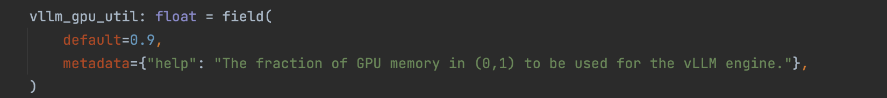
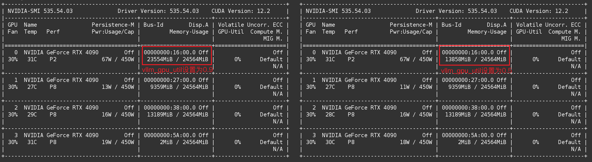
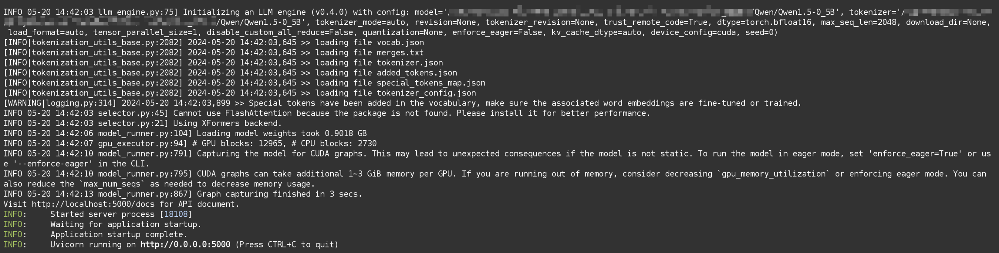
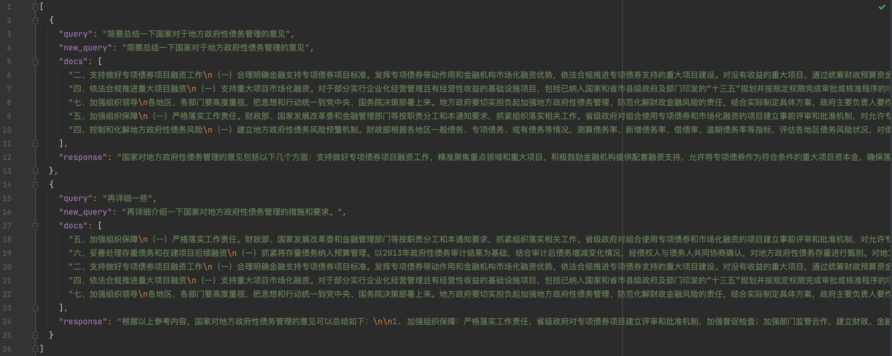
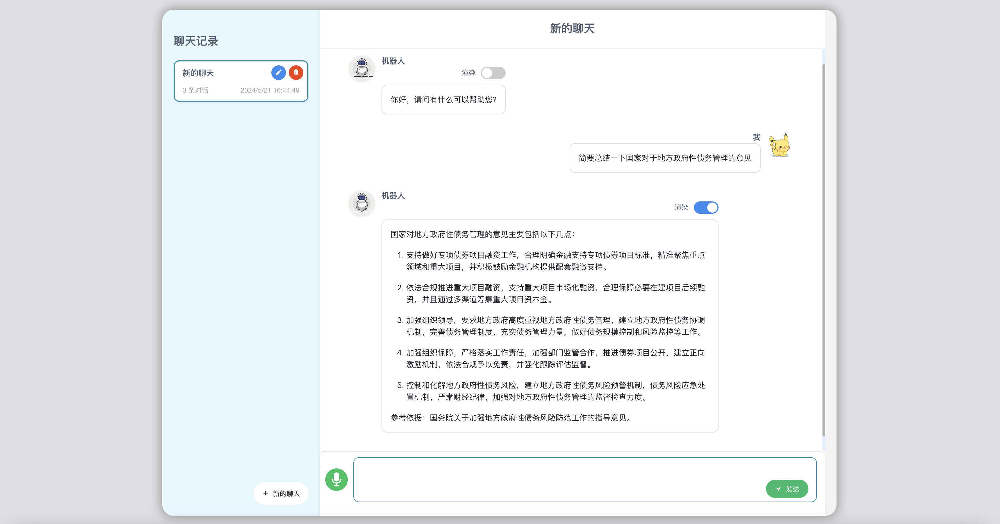

## rag-omni

## 1. 实例场景及服务器环境

### 1.1 服务器测试环境

实验环境：实体GPU服务器，NVIDIA RTX 4090 / 24GB，CentOS 7.9，Anaconda3-2019.03，CUDA 12.4

如果没有GPU服务器，可以租用AutoDL等平台的。服务器的租用及基础环节的安装这里就不赘述了，详见我的另一篇博客：[常用深度学习平台的使用指南](https://www.eula.club/blogs/常用深度学习平台的使用指南.html)

### 1.2 实例场景及源码

实例场景概述：有一批内部的政府政策文档，需要基于这些文档进行垂直领域的RAG问答。

本项目我已经在Github上进行了开源，项目地址为：[https://github.com/Logistic98/rag-omni](https://github.com/Logistic98/rag-omni)

- 注：仅作为示例演示整个RAG的过程，实际应用追求效果的话，这些是远远不够的，开源模型和检索算法的性能不够好，也有很多特殊情况需要处理。

```
.
├── README.md
├── data                  // 示例数据
│   ├── original_data          // 原始文档数据
│   └── preprocess_data        // 处理后的结构化数据
├── convert               // 转换数据
│   ├── data_convert_json      // 数据结构化转换脚本
│   └── marker_parse_pdf       // Marker解析PDF工具
├── llm                   // 大模型服务
│   ├── nginx_balance          // Nginx负载均衡
│   ├── llm_server.py          // 部署本地大模型服务
│   ├── llmtuner               // 部署本地大模型服务的核心代码
│   ├── models                 // 存放本地大模型的模型文件
│   └── test                   // 测试大模型服务的脚本
├── retrieval            // 检索服务
│   ├── bge                    // BGE检索算法的核心代码
│   ├── bm25                   // BM25检索算法的核心代码
│   ├── openai_embedding       // OpenAI Embedding检索算法的核心代码
│   ├── code.py
│   ├── log.py
│   ├── response.py
│   ├── retrieval_index.py     // 构建索引文件的脚本
│   ├── retrieval_server.py    // 部署检索服务
│   └── test                   // 测试检索服务的脚本
├── rag                  // RAG服务
│   ├── code.py
│   ├── log.py
│   ├── rag_server.py           // 部署RAG服务
│   ├── rag_solve.py            // RAG处理逻辑的核心代码
│   ├── response.py
│   └── test                    // 测试RAG服务的脚本
└── chat                 // RAG页面 
    ├── babel.config.js
    ├── jsconfig.json
    ├── package.json
    ├── public
    ├── src                     // RAG页面的主要源码
    └── vue.config.js
```

### 1.3 原始数据预处理

#### 1.3.1 数据预处理要求

数据预处理：需要将数据预处理成结构化数据之后，才能方便的构建检索库。

- 数据预处理要求：每个文档拆开，拆开后每个数据是文档中的某一段，目的是保证每条数据都有较完整的语义，并且长度不会太长。
- 数据预处理方式：提供的文档主要是Word、PDF等格式，无法直接使用。数据量少的话，可以直接人工去处理。数据量大的话，建议先使用脚本批量处理一下，有些解析不成功的再人工处理。


#### 1.3.2 数据预处理脚本

PDF格式是非常难处理的，如果是文本类型的可以使用以下脚本来初步处理，如果本身就是图片类型的，那该脚本解析不了，就需要OCR技术来辅助了。关于复杂PDF文件的解析可以使用 Marker 工具。

./rag-omni/convert/data_convert_json/pdf_to_docx.py

```python
# -*- coding: utf-8 -*-

import os
from pdf2docx import Converter
import argparse

parser = argparse.ArgumentParser(description="服务调用方法：python3 pdf_to_docx.py --pdf_path 'xxx.pdf' --docx_path 'xxx.docx'")
parser.add_argument("--pdf_path", type=str, required=True, help="要解析的 PDF 文件地址")
parser.add_argument("--docx_path", type=str, required=True, help="解析后的 DOCX 文件输出地址")
args = parser.parse_args()

docx_dir = os.path.dirname(args.docx_path)
if not os.path.exists(docx_dir):
    os.makedirs(docx_dir)

try:
    # 初始化转换器并转换 PDF 到 DOCX
    cv = Converter(args.pdf_path)
    cv.convert(args.docx_path)  # 默认转换所有页面
    cv.close()
    print("PDF 文件已成功转换为 DOCX 格式。")
except Exception as e:
    print(f"转换过程中发生错误：{str(e)}")
```

./rag-omni/convert/data_convert_json/docx_to_json.py

```python
# -*- coding: utf-8 -*-

import os
from docx import Document
import json
import argparse

parser = argparse.ArgumentParser(description="服务调用方法：python3 docx_to_json.py --docx_path 'xxx.docx' --output_path 'xxx.json' --max_length 500")
parser.add_argument("--docx_path", type=str, required=True, help="docx 文件地址")
parser.add_argument("--output_path", type=str, required=True, help="结果输出地址")
parser.add_argument("--max_length", default=500, type=int, help="切片大小")
args = parser.parse_args()

docx = Document(args.docx_path)
max_length = args.max_length

result = []
current_text = ""

for paragraph in docx.paragraphs:
    section = paragraph.text.strip()
    if not current_text or len(current_text) + len(section) + 1 <= max_length:
        current_text += " " + section
    else:
        result.append({
            "file_name": os.path.basename(args.docx_path),
            "part_content": current_text.strip()
        })
        current_text = section

if current_text:
    result.append({
        "file_name": os.path.basename(args.docx_path),
        "part_content": current_text.strip()
    })

output_dir = os.path.dirname(args.output_path)
if not os.path.exists(output_dir):
    os.makedirs(output_dir)

with open(args.output_path, "w", encoding="utf-8") as file:
    json.dump(result, file, ensure_ascii=False, indent=2)

print(f"{args.docx_path} 处理完成")
```

## 2. 部署大模型服务

后面的检索服务和RAG服务，对接了 OpenAI 风格的 API，可以使用任意符合该格式的服务。如果有数据保密、本地化部署的需求，可以使用本地化部署的大模型服务。如果直接使用外部的API，本节可跳过。

### 2.1 LLaMA-Factory的推理服务

这里用了 [LLaMA-Factory](https://github.com/hiyouga/LLaMA-Factory) 项目的 /src/llmtuner 部分，它支持了 vLLM，对推理进行了加速，本项目代码里用的版本需要要求 vllm==0.4.0 版本。

```
llm
├── llm_server.py
├── llmtuner
│   ├── api
│   ├── chat
│   ├── data
│   ├── extras
│   ├── hparams
│   └── model
├── models
│   ├── download_baichuan_model.py
│   └── download_qwen_model.py
└── test
    ├── llm_server_stress_test.py
    └── llm_server_test.py
```

注：开启vLLM可以充分利用显卡计算资源，带来更好的推理性能，详见我的另一篇博客：[基于vLLM加速大模型推理服务](https://www.eula.club/blogs/基于vLLM加速大模型推理服务.html)

### 2.2 部署大模型服务并进行测试

#### 2.2.1 下载基座大模型

这里下载Qwen1.5-0.5B大模型

models文件夹提供了 Qwen、Baichuan 模型的下载脚本（不仅限于这些，模型的支持情况详见 LLaMA-Factory 项目），这里使用 Qwen1.5-0.5B 进行实验。

```python
# -*- coding: utf-8 -*-

import os
from huggingface_hub import snapshot_download

# 设置代理
# os.environ['http_proxy'] = 'http://127.0.0.1:7890'
# os.environ['https_proxy'] = 'http://127.0.0.1:7890'

# 模型仓库的标识
repo_id = "Qwen/Qwen1.5-0.5B"

# 下载模型到指定目录
local_dir = "./Qwen1.5-0.5B"

# 检查目录是否存在，如果不存在则创建
if not os.path.exists(local_dir):
    os.makedirs(local_dir)

snapshot_download(repo_id=repo_id, local_dir=local_dir)
```

#### 2.2.2 启动大模型服务

启动Qwen大模型服务

```shell
$ cd ./llm
$ CUDA_VISIBLE_DEVICES=0 python3 llm_server.py \
    --model_name_or_path ./models/Qwen1.5-0.5B \
    --template default \
    --infer_backend vllm \
    --vllm_gpu_util 0.9
```

注：vllm_gpu_util 参数用于控制显存占用比例，默认值为0.9，详见 ./rag-omni/llm/llmtuner/hparams/model_args.py



不同vllm_gpu_util参数设置的显存占用对比：



启动之后，使用浏览器打开此地址：`http://<your_server_ip>:5000/docs `，可以访问到接口文档。



#### 2.2.3 测试大模型服务

测试Qwen大模型服务，执行 ./rag-omni/llm/test/llm_server_test.py 脚本即可进行测试。

```python
# -*- coding: utf-8 -*-

import json
import requests


def send_post_request(url, payload):
    """
    向指定的URL发送POST请求。
    """
    headers = {
        "accept": "application/json",
        "Content-Type": "application/json"
    }

    updated_payload = {
        "model": "qwen-1.5-0.5b",
        "messages": [
            {
                "role": "user",
                "content": payload["prompt"]
            }
        ],
        "tools": [
            {
                "type": "function",
                "function": {
                    "name": "string",
                    "description": "string",
                    "parameters": {}
                }
            }
        ],
        "temperature": 0,
        "top_p": 0,
        "n": 1,
        "max_tokens": 0,
        "stream": False
    }

    response = requests.post(url, headers=headers, data=json.dumps(updated_payload))
    try:
        response_json = response.json()
        print(response_json)
    except ValueError:
        print("Response could not be decoded as JSON:", response.text)


if __name__ == '__main__':
    api_url = 'http://127.0.0.1:5000/v1/chat/completions'
    payload = {
        "prompt": "解释一下量子计算"
    }
    send_post_request(api_url, payload)
```

它的请求与返回格式都是标准 OpenAI API 形式。

```json
{
    "id": "chatcmpl-987741d7e7f049dd864b7fae170d36e1",
    "object": "chat.completion",
    "created": 1715835635,
    "model": "qwen-1.5-0.5b",
    "choices": [
        {
            "index": 0,
            "message": {
                "role": "assistant",
                "content": "量子计算是一种利用量子力学原理进行计算的计算机技术。与经典计算机使用二进制位（0和1）进行计算不同，量子计算机使用量子比特（qubit）进行计算。这种量子比特可以同时处于0和1的状态，而传统计算机只能在0和1之间进行比较和计算。量子计算的优点包括量子纠错和量子计算速度的提高，这些都使得它在许多领域，如模拟和预测、加密和加密、模拟和模拟、模拟和模拟、模拟和模拟等方面具有潜力。\n量子计算与经典计算机相比有许多显著的优势，例如：\n1.量子纠错：量子计算机可以对输入数据进行更加精确的计算，因为它可以同时计算出多个状态，从而避免了传统计算机中的错误。\n2.量子计算速度的提高：由于量子比特可以同时处于0和1的状态，因此量子计算机的计算速度比经典计算机更快。\n3.量子纠错和量子计算速度的提高：量子计算机可以对输入数据进行更加精确的计算，因为它可以同时计算出多个状态，从而避免了传统计算机中的错误。\n4.量子纠错和量子计算速度的提高：量子计算机可以对输入数据进行更加精确的计算，因为它可以同时计算出多个状态，从而避免了传统计算机中的错误。\n因此，量子计算是一种非常有前途的计算机技术，具有许多优势，例如量子纠错、量子计算速度的提高、量子纠错和量子计算速度的提高等。",
                "tool_calls": null
            },
            "finish_reason": "stop"
        }
    ],
    "usage": {
        "prompt_tokens": 12,
        "completion_tokens": 302,
        "total_tokens": 314
    }
}
```

注：执行 ./rag-omni/llm/test/llm_server_stress_test.py 脚本即可进行压力测试。


### 2.3 使用Nginx配置负载均衡

需求情景：一台服务器上有多张显卡，用不同的显卡部署了多个大模型服务，现在想要进一步提高大模型服务的并发量，可以使用Nginx负载均衡来实现。

- 有关Nginx负载均衡的具体配置策略这里不再赘述，详见我的另一篇博客：[Docker容器化及项目环境管理](https://www.eula.club/blogs/Docker容器化及项目环境管理.html)

这里假设启动了3个大模型服务，端口号分别是4997、4998、4999，现在想要将其都配置到5000端口上。修改以下配置文件，换成实际的服务地址，weight=1是权重，这里默认各服务为相同权重。

./rag-omni/llm/nginx_balance/nginx_balance.conf

```ini
upstream nginx_balance {
        server 127.0.0.1:4999 weight=1;
        server 127.0.0.1:4998 weight=1;
        server 127.0.0.1:4997 weight=1;
}
server {
    listen       5000;
    server_name  127.0.0.1;
    location ~* ^(/) {
        gzip on;
        gzip_vary on;
	    gzip_min_length 1k;
	    gzip_buffers 16 16k;
        gzip_http_version 1.1;
        gzip_comp_level 9;
        gzip_types text/plain application/javascript application/x-javascript text/css text/xml text/javascript application/json;
        proxy_pass http://nginx_balance;
        client_max_body_size    48m;
        include proxy.conf;
    }
}
```

./rag-omni/llm/nginx_balance/build.sh

```shell
#!/bin/bash

docker build -t 'nginx_balance_image' .
docker run -itd --name nginx_balance -h nginx_balance -p 5000:5000 nginx_balance_image
docker update nginx_balance --restart=always
```

给 build.sh 添加可执行权限，执行该脚本即可部署负载均衡。

## 3. 部署检索服务

### 3.1 源码结构概述

构建检索服务分为两步，先使用知识文件构建索引，再使用索引构建检索服务。

```
retrieval
├── bge
│   ├── bge-large-zh-v1.5                 // bge模型文件
│   ├── bge_download_model.py             // 下载bge模型文件的脚本    
│   ├── bge_index.py                      // 构建bge索引
│   ├── bge_retrieval.py                  // 使用bge索引进行检索
│   └── index                             // bge索引文件
├── bm25
│   ├── bm25_index.py                     // 构建bm25索引
│   ├── bm25_retrieval.py                 // 使用bm25索引进行检索
│   ├── index                             // bm25索引文件
│   └── stop_words.txt                    // 停用词
├── openai_embedding
│   ├── openai_index.py                   // 构建openai_embedding索引
│   ├── openai_retrieval.py               // 使用openai_embedding索引进行检索
│   └── index                             // openai_embedding索引文件
├── code.py
├── log.py
├── response.py
├── retrieval_index.py                    // 构建索引文件脚本
├── retrieval_server.py                   // 部署检索服务
└── test
    └── retrieval_test.py                 // 测试检索服务
```

### 3.2 BM25检索算法

BM25算法较为简单，这里就直接实现了。除此之外，BM25为ES默认的相关性排序算法，也可以借助ES去实现。

#### 3.2.1 构建BM25索引

支持增量构建BM25索引，因此 main 里的构建索引拆成了两步作为示例。索引路径和索引名可以自行指定，如果不指定索引名则自动使用uuid生成。

./rag-omni/retrieval/bm25/bm25_index.py

```python
# -*- coding: utf-8 -*-

import math
import os
import jieba
import logging
import json
import uuid

jieba.setLogLevel(log_level=logging.INFO)


class BM25Param(object):
    def __init__(self, f, df, idf, length, avg_length, docs_list, line_length_list, k1=1.5, k2=1.0, b=0.75):
        self.f = f
        self.df = df
        self.k1 = k1
        self.k2 = k2
        self.b = b
        self.idf = idf
        self.length = length
        self.avg_length = avg_length
        self.docs_list = docs_list
        self.line_length_list = line_length_list

    def __str__(self):
        return f"k1:{self.k1}, k2:{self.k2}, b:{self.b}"


class BM25Indexer(object):
    def __init__(self, file_paths, old_index_path=None):
        self.file_paths = file_paths
        self.old_index_path = old_index_path
        self._stop_words = self._load_stop_words()

    def _load_stop_words(self):
        current_dir = os.path.dirname(os.path.abspath(__file__))
        stop_words_path = os.path.join(current_dir, 'stop_words.txt')
        if not os.path.exists(stop_words_path):
            raise Exception(f"system stop words: {stop_words_path} not found")
        stop_words = []
        with open(stop_words_path, 'r', encoding='utf8') as reader:
            for line in reader:
                line = line.strip()
                stop_words.append(line)
        return stop_words

    def _load_old_index(self):
        if not self.old_index_path or not os.path.exists(self.old_index_path):
            return None
        with open(self.old_index_path, 'r', encoding='utf8') as f:
            old_index_data = json.load(f)
        return BM25Param(**old_index_data)

    def _merge_indexes(self, old_param, new_param):
        if not old_param:
            return new_param

        combined_length = old_param.length + new_param.length
        combined_avg_length = (
            (old_param.avg_length * old_param.length) + (new_param.avg_length * new_param.length)
        ) / combined_length

        for word, freq in new_param.df.items():
            if word in old_param.df:
                old_param.df[word] += freq
            else:
                old_param.df[word] = freq

        for word, score in new_param.idf.items():
            if word in old_param.idf:
                old_param.idf[word] = (old_param.idf[word] * old_param.length + score * new_param.length) / combined_length
            else:
                old_param.idf[word] = score

        old_param.f.extend(new_param.f)
        old_param.docs_list.extend(new_param.docs_list)
        old_param.line_length_list.extend(new_param.line_length_list)

        old_param.length = combined_length
        old_param.avg_length = combined_avg_length

        return old_param

    def _build_param(self):
        def _cal_param(docs_data):
            f = []
            df = {}
            idf = {}
            length = len(docs_data)
            words_count = 0
            docs_list = []
            line_length_list = []
            for doc in docs_data:
                content = doc.get("part_content", "").strip()
                if not content:
                    continue
                words = [word for word in jieba.lcut(content) if word and word not in self._stop_words]
                line_length_list.append(len(words))
                docs_list.append(doc)
                words_count += len(words)
                tmp_dict = {}
                for word in words:
                    tmp_dict[word] = tmp_dict.get(word, 0) + 1
                f.append(tmp_dict)
                for word in tmp_dict.keys():
                    df[word] = df.get(word, 0) + 1
            for word, num in df.items():
                idf[word] = math.log((length - num + 0.5) / (num + 0.5) + 1)
            param = BM25Param(f, df, idf, length, words_count / length, docs_list, line_length_list)
            return param

        docs_data = []
        for file_path in self.file_paths:
            if not os.path.exists(file_path):
                raise Exception(f"input docs {file_path} not found")
            with open(file_path, 'r', encoding='utf8') as reader:
                docs = json.load(reader)
                for doc in docs:
                    doc["file_path"] = file_path
                docs_data.extend(docs)

        new_param = _cal_param(docs_data)
        old_param = self._load_old_index()

        return self._merge_indexes(old_param, new_param)

    def build_index(self, output_path, index_name=None):
        param = self._build_param()
        if not os.path.exists(output_path):
            os.makedirs(output_path)
        if not index_name:
            index_name = str(uuid.uuid4())
        index_file = os.path.join(output_path, f'{index_name}.json')
        with open(index_file, 'w', encoding='utf8') as f:
            json.dump(param.__dict__, f, ensure_ascii=False, indent=4)
        print(f"Index saved to {index_file}")


if __name__ == '__main__':

    index_name = "bm25_index"      # 定义索引名（如果不指定则自动使用uuid生成）
    output_path = "./index"        # 定义索引的存储路径

    # 用一个文件构建初始索引
    file_paths = [
        "../../data/preprocess_data/国务院关于加强地方政府性债务管理的意见.json"
    ]
    indexer = BM25Indexer(file_paths)
    indexer.build_index(output_path, index_name=index_name)

    # 用另一个文件和旧索引增量构建新索引
    file_paths = [
        "../../data/preprocess_data/中共中央办公厅国务院办公厅印发《关于做好地方政府专项债券发行及项目配套融资工作的通知》.json"
    ]
    old_index_path = "{}/{}.json".format(output_path, index_name)
    indexer = BM25Indexer(file_paths, old_index_path)
    indexer.build_index(output_path, index_name=index_name)
```

#### 3.2.2 实现BM25检索

./rag-omni/retrieval/bm25/bm25_retrieval.py

```python
# -*- coding: utf-8 -*-

import os
import jieba
import logging
import json

jieba.setLogLevel(log_level=logging.INFO)


class BM25Param(object):
    def __init__(self, f, df, idf, length, avg_length, docs_list, line_length_list, k1=1.5, k2=1.0, b=0.75):
        self.f = f
        self.df = df
        self.k1 = k1
        self.k2 = k2
        self.b = b
        self.idf = idf
        self.length = length
        self.avg_length = avg_length
        self.docs_list = docs_list
        self.line_length_list = line_length_list

    def __str__(self):
        return f"k1:{self.k1}, k2:{self.k2}, b:{self.b}"


class BM25Retrieval(object):
    def __init__(self, index_path):
        self.index_path = index_path
        self.param: BM25Param = self._load_param()
        self._stop_words = self._load_stop_words()

    def _load_stop_words(self):
        current_dir = os.path.dirname(os.path.abspath(__file__))
        stop_words_path = os.path.join(current_dir, 'stop_words.txt')
        if not os.path.exists(stop_words_path):
            raise Exception(f"system stop words: {stop_words_path} not found")
        stop_words = []
        with open(stop_words_path, 'r', encoding='utf8') as reader:
            for line in reader:
                line = line.strip()
                stop_words.append(line)
        return stop_words

    def _load_param(self):
        if not os.path.exists(self.index_path):
            raise Exception(f"Index file {self.index_path} not found")
        with open(self.index_path, 'r', encoding='utf8') as f:
            data = json.load(f)
            param = BM25Param(**data)
        param.length = len(param.f)
        return param

    def _cal_similarity(self, words, index):
        score = 0
        for word in words:
            if word not in self.param.f[index]:
                continue
            molecular = self.param.idf[word] * self.param.f[index][word] * (self.param.k1 + 1)
            denominator = self.param.f[index][word] + self.param.k1 * (1 - self.param.b +
                                                                       self.param.b * self.param.line_length_list[
                                                                           index] /
                                                                       self.param.avg_length)
            score += molecular / denominator
        return score

    def search(self, query: str, top_k: int = -1):
        if top_k != -1 and top_k <= 0:
            raise ValueError("top_k should be -1 or a positive integer")

        words = [word for word in jieba.lcut(query) if word and word not in self._stop_words]
        score_list = []
        for index in range(len(self.param.f)):
            if index >= len(self.param.f):
                raise IndexError(f"Index {index} is out of range for parameter f")
            score = self._cal_similarity(words, index)
            score_list.append((self.param.docs_list[index], score))

        score_list.sort(key=lambda x: -x[1])
        if top_k != -1:
            score_list = score_list[:top_k]

        result = [
            {
                "file_name": doc["file_name"],
                "part_content": doc["part_content"],
                "score": score
            }
            for doc, score in score_list
        ]
        return result


if __name__ == '__main__':
    index_path = "./index/bm25_index.json"
    bm25 = BM25Retrieval(index_path)
    query_content = "国务院对于地方政府性债务管理的意见"
    top_k = 5  # 可以设置为任意正整数，或者-1表示不限制
    result = bm25.search(query_content, top_k)
    print(json.dumps(result, ensure_ascii=False, indent=4))
```

注：代码中会用到 stop_words.txt 文件，已经放到项目里了，这里就不展示了。

### 3.3 BGE检索算法

BGE向量检索需要下载 BAAI/bge-large-zh-v1.5 模型文件，项目里提供了模型下载脚本。

 ./rag-omni/retrieval/bge/download_bge_model.py

```python
# -*- coding: utf-8 -*-

import os
from transformers import AutoTokenizer, AutoModel
from transformers.utils import logging

# 设置代理
# os.environ['http_proxy'] = 'http://127.0.0.1:7890'
# os.environ['https_proxy'] = 'http://127.0.0.1:7890'

# 配置 transformers 日志
logging.set_verbosity_info()


def download_and_save_model(model_name, save_directory):
    # 下载模型和分词器
    tokenizer = AutoTokenizer.from_pretrained(model_name)
    model = AutoModel.from_pretrained(model_name)
    # 保存模型和分词器
    tokenizer.save_pretrained(save_directory)
    model.save_pretrained(save_directory)
    print(f"模型和分词器已保存到 {save_directory}")


if __name__ == '__main__':
    model_name = 'BAAI/bge-large-zh-v1.5'
    save_directory = './bge-large-zh-v1.5'
    download_and_save_model(model_name, save_directory)
```

#### 3.3.1 构建BGE索引

支持增量构建BGE索引，因此 main 里的构建索引拆成了两步作为示例。索引路径和索引名可以自行指定，如果不指定索引名则自动使用uuid生成。

./rag-omni/retrieval/bge/bge_index.py

```python
# -*- coding: utf-8 -*-

import os
import json
import numpy as np
from tqdm import trange
from transformers import AutoTokenizer, AutoModel
import torch
import uuid


class BGEIndexer:
    def __init__(self, file_paths, old_index_path=None):
        self.device = torch.device("cuda" if torch.cuda.is_available() else "cpu")
        current_dir = os.path.dirname(os.path.abspath(__file__))
        self.model_path = os.path.join(current_dir, 'bge-large-zh-v1.5')
        self.tokenizer = AutoTokenizer.from_pretrained(self.model_path)
        self.model = AutoModel.from_pretrained(self.model_path).to(self.device)
        self.old_index_path = old_index_path
        self.data_list = self.load_data(file_paths)
        self.embeddings_list = self.generate_embeddings()
        self.cuda_oom_flag = False

    def load_data(self, file_paths):
        data_list = []
        for file_path in file_paths:
            with open(file_path, "r", encoding="utf-8") as f:
                data = json.load(f)
            data_list.extend(data)
        return data_list

    def generate_embeddings(self):
        embeddings_list = []
        batch_size = 4
        has_switched_to_cpu = False
        for i in trange(0, len(self.data_list), batch_size):
            batch_texts = [item['part_content'] for item in self.data_list[i:i + batch_size]]
            inputs = self.tokenizer(batch_texts, return_tensors='pt', padding=True, truncation=True, max_length=512).to(
                self.device)
            try:
                with torch.no_grad():
                    outputs = self.model(**inputs)
                embeddings = outputs.last_hidden_state.mean(dim=1).to('cpu').numpy()
            except RuntimeError as e:
                if 'CUDA out of memory' in str(e):
                    if not has_switched_to_cpu:
                        print("CUDA out of memory. Switching to CPU for this batch.")
                        has_switched_to_cpu = True
                    torch.cuda.empty_cache()
                    inputs = inputs.to('cpu')
                    self.model.to('cpu')
                    with torch.no_grad():
                        outputs = self.model(**inputs)
                    embeddings = outputs.last_hidden_state.mean(dim=1).numpy()
                    self.model.to(self.device)
                else:
                    raise e
            embeddings_list.extend(embeddings)
            torch.cuda.empty_cache()
        return np.array(embeddings_list)

    def _load_old_index(self):
        if not self.old_index_path or not os.path.exists(self.old_index_path):
            return None, None
        data = np.load(self.old_index_path, allow_pickle=True)
        old_embeddings_list = data['embeddings_list']
        old_data_list_json = data['data_list'].item()
        old_data_list = json.loads(old_data_list_json)
        return old_data_list, old_embeddings_list

    def _merge_indexes(self, old_data_list, old_embeddings_list):
        if old_data_list is None or old_embeddings_list is None:
            return self.data_list, self.embeddings_list
        new_data_list = old_data_list + self.data_list
        new_embeddings_list = np.vstack((old_embeddings_list, self.embeddings_list))
        return new_data_list, new_embeddings_list

    def build_index(self, output_path, index_name=None):
        if not os.path.exists(output_path):
            os.makedirs(output_path)
        if not index_name:
            index_name = str(uuid.uuid4())
        index_file = os.path.join(output_path, f'{index_name}.npz')

        old_data_list, old_embeddings_list = self._load_old_index()
        merged_data_list, merged_embeddings_list = self._merge_indexes(old_data_list, old_embeddings_list)

        data_list_json = json.dumps(merged_data_list, ensure_ascii=False, indent=4)
        np.savez(index_file, embeddings_list=merged_embeddings_list, data_list=data_list_json)
        print(f"Index saved to {index_file}")


if __name__ == '__main__':
    index_name = "bge_index"  # 定义索引名（如果不指定则自动使用uuid生成）
    output_path = "./index"   # 定义索引的存储路径

    # 用一个文件构建初始索引
    file_paths = [
        "../../data/preprocess_data/国务院关于加强地方政府性债务管理的意见.json"
    ]
    indexer = BGEIndexer(file_paths)
    indexer.build_index(output_path, index_name=index_name)

    # 用另一个文件和旧索引增量构建新索引
    file_paths = [
        "../../data/preprocess_data/中共中央办公厅国务院办公厅印发《关于做好地方政府专项债券发行及项目配套融资工作的通知》.json"
    ]
    old_index_path = os.path.join(output_path, f'{index_name}.npz')
    indexer = BGEIndexer(file_paths, old_index_path)
    indexer.build_index(output_path, index_name=index_name)
```

#### 3.3.2 实现BGE检索

./rag-omni/retrieval/bge/bge_retrieval.py

```python
# -*- coding: utf-8 -*-

import os
import json
import numpy as np
from transformers import AutoTokenizer, AutoModel
import torch
import faiss


class BGERetrieval:
    def __init__(self, index_file):
        self.device = torch.device("cuda" if torch.cuda.is_available() else "cpu")
        current_dir = os.path.dirname(os.path.abspath(__file__))
        self.model_path = os.path.join(current_dir, 'bge-large-zh-v1.5')
        self.tokenizer = AutoTokenizer.from_pretrained(self.model_path)
        self.model = AutoModel.from_pretrained(self.model_path)
        self.data_list, self.embeddings_list = self.load_index(index_file)
        self.faiss_index = self.build_faiss_index()

    def load_index(self, index_file):
        data = np.load(index_file, allow_pickle=True)
        embeddings_list = data['embeddings_list']
        data_list_json = data['data_list'].item()
        data_list = json.loads(data_list_json)
        return data_list, embeddings_list

    def build_faiss_index(self):
        faiss_index = faiss.IndexFlatIP(self.embeddings_list.shape[1])
        faiss_index.add(self.embeddings_list)
        return faiss_index

    def search(self, query, top_k=-1):
        inputs = self.tokenizer(query, return_tensors='pt', padding=True, truncation=True, max_length=512).to(self.device)
        with torch.no_grad():
            outputs = self.model(**inputs)
        query_emb = outputs.last_hidden_state.mean(dim=1).to('cpu').numpy()
        if top_k == -1:
            top_k = len(self.data_list)
        score, rank = self.faiss_index.search(query_emb, top_k)
        rank = rank[0]
        score = score[0]
        results = [
            {
                "file_name": self.data_list[rank[i]]["file_name"],
                "part_content": self.data_list[rank[i]]["part_content"],
                "score": float(score[i])
            }
            for i in range(top_k)
        ]
        return results


if __name__ == '__main__':
    index_file = "./index/bge_index.npz"
    query_text = "国务院对于地方政府性债务管理的意见"
    top_k = -1  # 可以设置为任意正整数，或者-1表示不限制
    retriever = BGERetrieval(index_file)
    results = retriever.search(query_text, top_k)
    print(json.dumps(results, ensure_ascii=False, indent=4))
```

### 3.4 OpenAI Embedding检索算法

#### 3.4.1 构建OpenAI Embedding索引

./rag-omni/retrieval/openai_embedding/openai_index.py

```python
# -*- coding: utf-8 -*-

import os
import json
import pickle
import uuid

from langchain_community.vectorstores import FAISS
from langchain_openai import OpenAIEmbeddings


class OpenAIIndexer:
    def __init__(self, file_paths, openai_api_base, openai_api_key, embedding_model="text-embedding-3-large", old_index_path=None):
        self.embedding_model = self.create_embedding_model(openai_api_base, openai_api_key, embedding_model)
        self.old_index_path = old_index_path
        self.new_data_list, self.new_content, self.new_metadata = self.load_data(file_paths)

        if self.old_index_path and os.path.exists(self.old_index_path):
            self.old_data_list, self.old_content, self.old_metadata = self.load_existing_data()
            self.data_list = self.old_data_list + self.new_data_list
            self.content = self.old_content + self.new_content
            self.metadata = self.old_metadata + self.new_metadata
        else:
            self.data_list, self.content, self.metadata = self.new_data_list, self.new_content, self.new_metadata

        self.faiss_vectorstore = self.generate_embedding()

    def create_embedding_model(self, openai_api_base, openai_api_key, embedding_model):
        return {
            "openai_api_key": openai_api_key,
            "openai_api_base": openai_api_base,
            "model": embedding_model
        }

    def load_data(self, file_paths):
        """读取数据文件"""
        data_list = []
        content_list = []
        metadata_list = []
        for file_path in file_paths:
            with open(file_path, "r", encoding="utf-8") as f:
                data = json.load(f)
            for item in data:
                item['file_name'] = os.path.basename(file_path)
                data_list.append(item)
                content_list.append(item['part_content'])
                metadata_list.append({'file_name': os.path.basename(file_path)})
        return data_list, content_list, metadata_list

    def generate_embedding(self):
        embedding_model_instance = OpenAIEmbeddings(**self.embedding_model)
        return FAISS.from_texts(self.content, embedding_model_instance, metadatas=self.metadata)

    def get_index_folder(self, output_path, index_name):
        return os.path.join(output_path, index_name)

    def load_existing_data(self):
        index_folder = self.old_index_path
        embedding_path = os.path.join(index_folder, 'embeddings')

        with open(os.path.join(embedding_path, 'index.faiss'), 'rb') as f:
            index = pickle.load(f)

        with open(os.path.join(embedding_path, 'docstore.pkl'), 'rb') as f:
            docstore = pickle.load(f)

        with open(os.path.join(embedding_path, 'index_to_docstore_id.pkl'), 'rb') as f:
            index_to_docstore_id = pickle.load(f)

        embedding_model_instance = OpenAIEmbeddings(**self.embedding_model)
        faiss_vectorstore = FAISS(
            index=index,
            embedding_function=embedding_model_instance,
            docstore=docstore,
            index_to_docstore_id=index_to_docstore_id
        )

        with open(os.path.join(index_folder, 'content.pkl'), 'rb') as file:
            content = pickle.load(file)

        with open(os.path.join(index_folder, 'metadata.pkl'), 'rb') as file:
            metadata = pickle.load(file)

        # 重新构造数据列表
        data_list = [{'part_content': c, 'metadata': m} for c, m in zip(content, metadata)]
        return data_list, content, metadata

    def build_index(self, output_path, index_name=None):
        if not index_name:
            index_name = str(uuid.uuid4())
        index_folder = self.get_index_folder(output_path, index_name)
        os.makedirs(index_folder, exist_ok=True)
        embedding_path = os.path.join(index_folder, 'embeddings')
        os.makedirs(embedding_path, exist_ok=True)

        with open(os.path.join(embedding_path, 'index.faiss'), 'wb') as f:
            pickle.dump(self.faiss_vectorstore.index, f)

        with open(os.path.join(embedding_path, 'docstore.pkl'), 'wb') as f:
            pickle.dump(self.faiss_vectorstore.docstore, f)

        with open(os.path.join(embedding_path, 'index_to_docstore_id.pkl'), 'wb') as f:
            pickle.dump(self.faiss_vectorstore.index_to_docstore_id, f)

        with open(os.path.join(index_folder, 'embedding_model_params.pkl'), 'wb') as file:
            pickle.dump(self.embedding_model, file)

        with open(os.path.join(index_folder, 'content.pkl'), 'wb') as file:
            pickle.dump(self.content, file)

        with open(os.path.join(index_folder, 'metadata.pkl'), 'wb') as file:
            pickle.dump(self.metadata, file)

        print(f"Index saved to {index_folder}")


if __name__ == '__main__':
    index_name = "openai_index"  # 定义索引名（如果不指定则自动使用uuid生成）
    output_path = "./index"  # 定义索引的存储路径
    openai_api_base = "https://api.openai.com/v1"
    openai_api_key = "sk-xxx"

    # 用一个文件构建初始索引
    file_paths = [
        "../../data/preprocess_data/国务院关于加强地方政府性债务管理的意见.json"
    ]
    indexer = OpenAIIndexer(file_paths, openai_api_base, openai_api_key)
    indexer.build_index(output_path, index_name)

    # 用另一个文件和旧索引增量构建新索引
    new_file_paths = [
        "../../data/preprocess_data/中共中央办公厅国务院办公厅印发《关于做好地方政府专项债券发行及项目配套融资工作的通知》.json"
    ]
    old_index_path = os.path.join(output_path, index_name)
    indexer = OpenAIIndexer(new_file_paths, openai_api_base, openai_api_key, old_index_path=old_index_path)
    indexer.build_index(output_path, index_name)
```

#### 3.4.2 实现OpenAI Embedding检索

./rag-omni/retrieval/openai_embedding/openai_retrieval.py

```python
# -*- coding: utf-8 -*-

import os
import pickle
from langchain_community.vectorstores import FAISS
from langchain_openai import OpenAIEmbeddings
import json


class OpenAIRetrieval:
    def __init__(self, index_folder):
        self.embedding_model_params = self.load_embedding_model_params(index_folder)
        self.embedding_model = OpenAIEmbeddings(**self.embedding_model_params)
        self.faiss_vectorstore, self.content, self.metadata = self.load_data(index_folder)

    def load_embedding_model_params(self, index_folder):
        embedding_model_path = os.path.join(index_folder, 'embedding_model_params.pkl')
        if not os.path.exists(embedding_model_path):
            raise FileNotFoundError(f"Embedding model params file not found: {embedding_model_path}")
        with open(embedding_model_path, 'rb') as file:
            embedding_model_params = pickle.load(file)
        return embedding_model_params

    def load_data(self, index_folder):
        embedding_path = os.path.join(index_folder, 'embeddings')
        index_file = os.path.join(embedding_path, 'index.faiss')
        docstore_file = os.path.join(embedding_path, 'docstore.pkl')
        index_to_docstore_id_file = os.path.join(embedding_path, 'index_to_docstore_id.pkl')

        if not os.path.exists(index_file):
            raise FileNotFoundError(f"FAISS index file not found: {index_file}")
        if not os.path.exists(docstore_file):
            raise FileNotFoundError(f"Docstore file not found: {docstore_file}")
        if not os.path.exists(index_to_docstore_id_file):
            raise FileNotFoundError(f"Index to docstore ID file not found: {index_to_docstore_id_file}")

        with open(index_file, 'rb') as f:
            index = pickle.load(f)
        with open(docstore_file, 'rb') as f:
            docstore = pickle.load(f)
        with open(index_to_docstore_id_file, 'rb') as f:
            index_to_docstore_id = pickle.load(f)

        embedding_model_instance = OpenAIEmbeddings(**self.embedding_model_params)
        faiss_vectorstore = FAISS(
            index=index,
            embedding_function=embedding_model_instance,
            docstore=docstore,
            index_to_docstore_id=index_to_docstore_id
        )

        content_file = os.path.join(index_folder, 'content.pkl')
        metadata_file = os.path.join(index_folder, 'metadata.pkl')

        if not os.path.exists(content_file):
            raise FileNotFoundError(f"Content file not found: {content_file}")
        if not os.path.exists(metadata_file):
            raise FileNotFoundError(f"Metadata file not found: {metadata_file}")

        with open(content_file, 'rb') as file:
            content = pickle.load(file)
        with open(metadata_file, 'rb') as file:
            metadata = pickle.load(file)
        return faiss_vectorstore, content, metadata

    def search(self, query, top_k=5):
        results = self.faiss_vectorstore.similarity_search(query, k=len(self.content))
        # 如果 top_k 为 -1，则返回所有结果
        if top_k == -1:
            top_k = len(results)
        results = results[:top_k]
        search_results = []
        for item in results:
            result = {
                "file_name": item.metadata['file_name'],
                "part_content": item.page_content
            }
            search_results.append(result)
        return search_results


if __name__ == '__main__':
    index_folder = "./index/openai_index"
    query_text = "国务院对于地方政府性债务管理的意见"
    top_k = 5  # 可以设置为任意正整数，或者-1表示不限制
    openai_retriever = OpenAIRetrieval(index_folder)
    results = openai_retriever.search(query_text, top_k=top_k)
    print(json.dumps(results, ensure_ascii=False, indent=4))
```

### 3.5 构建索引文件

#### 3.5.1 封装索引构建

./rag-omni/retrieval/retrieval_index.py

```python
# -*- coding: utf-8 -*-

import argparse
import logging
from bge.bge_index import BGEIndexer
from bm25.bm25_index import BM25Indexer
from openai_embedding.openai_index import OpenAIIndexer


# 配置日志
logging.basicConfig(level=logging.INFO, format='%(asctime)s - %(levelname)s - %(message)s')

if __name__ == '__main__':
    parser = argparse.ArgumentParser(description="构建索引的参数")
    parser.add_argument('--file_paths', type=str, nargs='+', required=True, help="JSON知识文件路径（支持一个或多个文件路径）")
    parser.add_argument('--algorithm', type=str, choices=['BM25', 'BGE', 'OpenAI'], required=True, help="索引算法：目前仅支持BM25、BGE、OpenAI")
    parser.add_argument('--api_base_url', type=str, default="https://api.openai.com/v1", help="LLM API Base URL")
    parser.add_argument('--api_key', type=str, help="LLM API Key")
    parser.add_argument('--output_path', type=str, required=True, help="索引存储路径")
    parser.add_argument('--index_name', type=str, required=False, help="索引名（可选，如果不指定则自动使用UUID生成）")
    parser.add_argument('--old_index_path', type=str, required=False, help="旧索引路径（可选，传递旧索引则增量构建）")
    args = parser.parse_args()

    file_paths = args.file_paths
    algorithm = args.algorithm
    api_base_url = args.api_base_url
    api_key = args.api_key
    output_path = args.output_path
    index_name = args.index_name
    old_index_path = args.old_index_path

    try:
        if algorithm == 'BGE':
            logging.info("开始构建BGE索引...")
            indexer = BGEIndexer(file_paths, old_index_path)
            indexer.build_index(output_path, index_name)
            logging.info("BGE索引构建成功")
        elif algorithm == 'BM25':
            logging.info("开始构建BM25索引...")
            indexer = BM25Indexer(file_paths, old_index_path)
            indexer.build_index(output_path, index_name)
            logging.info("BM25索引构建成功")
        elif algorithm == 'OpenAI':
            logging.info("开始构建OpenAI索引...")
            indexer = OpenAIIndexer(file_paths, api_base_url, api_key, old_index_path=old_index_path)
            indexer.build_index(output_path, index_name)
            logging.info("OpenAI索引构建成功")
        else:
            raise ValueError("Unsupported algorithm. Please choose either 'BM25' 'BGE' or 'OpenAI'.")
    except Exception as e:
        logging.error(f"索引构建失败: {e}")
        raise

```

#### 3.5.2 生成索引文件并测试

以下示例命令里为了演示增量构建索引的流程，将构建索引文件分成两步了，实际使用时可以一步进行构建。file_paths 参数传递知识文件，多个使用逗号进行分隔，旧索引路径是可选项，如果传递进去则会增量构建，不传递则使用知识文件从零构建。

```shell
// 构建BM25索引
$ python3 ./retrieval/retrieval_index.py --file_paths "./data/preprocess_data/国务院关于加强地方政府性债务管理的意见.json" --algorithm BM25 --output_path "./retrieval/bm25/index" --index_name "bm25_index"
$ python3 ./retrieval/retrieval_index.py --file_paths "./data/preprocess_data/中共中央办公厅国务院办公厅印发《关于做好地方政府专项债券发行及项目配套融资工作的通知》.json" --algorithm BM25 --output_path "./retrieval/bm25/index" --index_name "bm25_index" --old_index_path "./retrieval/bm25/index/bm25_index.json"

// 构建BGE索引
$ python3 ./retrieval/retrieval_index.py --file_paths "./data/preprocess_data/国务院关于加强地方政府性债务管理的意见.json" --algorithm BGE --output_path "./retrieval/bge/index" --index_name "bge_index"
$ python3 ./retrieval/retrieval_index.py --file_paths "./data/preprocess_data/中共中央办公厅国务院办公厅印发《关于做好地方政府专项债券发行及项目配套融资工作的通知》.json" --algorithm BGE --output_path "./retrieval/bge/index" --index_name "bge_index" --old_index_path "./retrieval/bge/index/bge_index.npz"

// 构建OpenAI Embedding索引
$ python3 ./retrieval/retrieval_index.py --file_paths "./data/preprocess_data/国务院关于加强地方政府性债务管理的意见.json" --algorithm OpenAI --output_path "./retrieval/openai_embedding/index" --index_name "openai_index" --api_base_url "https://api.openai.com/v1" --api_key "sk-xxx"
$ python3 ./retrieval/retrieval_index.py --file_paths "./data/preprocess_data/中共中央办公厅国务院办公厅印发《关于做好地方政府专项债券发行及项目配套融资工作的通知》.json" --algorithm OpenAI --output_path "./retrieval/openai_embedding/index" --index_name "openai_index" --old_index_path "./retrieval/openai_embedding/index/openai_index" --api_base_url "https://api.openai.com/v1" --api_key "sk-xxx"
```

注：构建完之后，拿对应检索程序里的 main 测试是否能够检索即可。

### 3.6 部署检索服务

#### 3.6.1 封装检索服务

这里使用 Flask 框架将检索算法封装成一个服务（log.py、response.py、code.py此处省略）。启动时需要传入知识库文件路径（json_files）、检索算法（algorithm）、服务端口号（port），/api/rag/retrieval 接口入参接受输入问题（question）和检索条数（top_k）。

./rag-omni/retrieval/retrieval_server.py

```python
# -*- coding: utf-8 -*-

import argparse
import json
from flask import Flask, jsonify
from flask_cors import CORS
from pre_request import pre, Rule

from log import logger
from response import ResponseCode, ResponseMessage
from bm25.bm25_retrieval import BM25Retrieval
from bge.bge_retrieval import BGERetrieval
from openai_embedding.openai_retrieval import OpenAIRetrieval

# 解析启动参数
parser = argparse.ArgumentParser(description="启动参数")
parser.add_argument('--index_path', type=str, required=True, help="索引路径")
parser.add_argument('--algorithm', type=str, choices=['BM25', 'BGE', 'OpenAI'], required=True, help="检索算法：目前仅支持BM25、BGE、OpenAI")
parser.add_argument('--port', type=int, default=5001, help="启动的端口号，默认5001")
args = parser.parse_args()

index_path = args.index_path
retrieval_algorithm = args.algorithm
port = args.port

# 创建一个服务
app = Flask(__name__)
CORS(app, supports_credentials=True)

# 初始化检索算法
if retrieval_algorithm == 'BM25':
    search_engine = BM25Retrieval(index_path)
elif retrieval_algorithm == 'BGE':
    search_engine = BGERetrieval(index_path)
elif retrieval_algorithm == 'OpenAI':
    search_engine = OpenAIRetrieval(index_path)
else:
    raise ValueError("Unsupported retrieval algorithm")

"""
# 检索算法服务
"""
@app.route(rule='/api/rag/retrieval', methods=['GET'])
def retrieval():

    # 参数校验
    rule = {
        "question": Rule(type=str, required=True),
        "top_k": Rule(type=int, required=True, gte=-1, custom=lambda x: x == -1 or x > 0)
    }
    try:
        params = pre.parse(rule=rule)
    except Exception as e:
        logger.error(e)
        fail_response = dict(code=ResponseCode.PARAM_FAIL, msg=ResponseMessage.PARAM_FAIL, data=None)
        logger.error(fail_response)
        response = jsonify(fail_response)
        response.data = json.dumps(fail_response, ensure_ascii=False, indent=4)
        return response

    # 获取参数
    question = params.get("question")
    top_k = params.get("top_k")

    # 业务处理模块
    try:
        results = search_engine.search(question, top_k)
    except Exception as e:
        logger.error(e)
        fail_response = dict(code=ResponseCode.BUSINESS_FAIL, msg=ResponseMessage.BUSINESS_FAIL, data=None)
        logger.error(fail_response)
        response = jsonify(fail_response)
        response.data = json.dumps(fail_response, ensure_ascii=False, indent=4)
        return response

    # 成功的结果返回，格式化JSON
    success_response = dict(code=ResponseCode.SUCCESS, msg=ResponseMessage.SUCCESS, data=results)
    logger.info(success_response)
    response = jsonify(success_response)
    response.data = json.dumps(success_response, ensure_ascii=False, indent=4)
    return response


if __name__ == '__main__':
    # 解决中文乱码问题
    app.config['JSON_AS_ASCII'] = False
    # 启动服务，指定主机和端口
    app.run(host='0.0.0.0', port=port, debug=False, threaded=True)
```

#### 3.6.2 启动检索服务并测试

选择索引文件启动检索服务，以下两种检索服务选择一个进行启动即可。

```shell
$ cd ./retrieval
$ python3 retrieval_server.py --index_path "./bm25/index/bm25_index.json" --algorithm BM25 --port 5001  // 启动BM25检索服务
$ python3 retrieval_server.py --index_path "./bge/index/bge_index.npz" --algorithm BGE --port 5001      // 启动BGE检索服务
$ python3 retrieval_server.py --index_path "./openai_embedding/index/openai_index" --algorithm OpenAI --port 5001 // 启动OpenAI Embedding检索服务
```

./rag-omni/retrieval/test/retrieval_test.py 可用来测试检索服务

```PYTHON
# -*- coding: utf-8 -*-

import requests


def retrieval_test(url, params):
    r = requests.get(url, params=params)
    print(r.text)


if __name__ == '__main__':
    url = 'http://{0}:{1}/api/rag/retrieval'.format("127.0.0.1", "5001")
    params = {'question': "国务院对于地方政府性债务管理的意见", 'top_k': 3}
    retrieval_test(url, params)
```

输出top_k条数据记录，得分降序排列，返回值格式如下：


## 4. 部署RAG服务

### 4.1 RAG服务的实现

#### 4.1.1 RAG服务核心逻辑

核心逻辑：用户输入的问题——>问题重构（根据历史对话补全信息得到新的问题）——>文档检索（用重构后的问题从检索库里搜索相关文档）——>给出大模型总结的答案（如果检索出来的文档与问题相关，则使用大模型根据相关文档进行总结；如果检索出来的文档与问题无关，则直接使用大模型进行回复并给出提示）

./rag-omni/rag/rag_solve.py

```python
# -*- coding: utf-8 -*-

import requests
import json
import os
import logging
from time import sleep

# 全局参数
RETRIEVAL_TOP_K = 5
LLM_HISTORY_LEN = 30
UNRELATED_RESPONSE = "很抱歉，检索库内不存在与问题相关的参考材料，以下是大模型直接生成的结果："

logging.basicConfig(level=logging.INFO)


class LLMService:
    def __init__(self, url, api_key, model):
        self.url = url
        self.headers = {
            "Authorization": f"Bearer {api_key}",
            "Content-Type": "application/json"
        }
        self.model = model

    def __call__(self, messages: list) -> str:
        data = {
            "model": self.model,
            "messages": messages
        }
        response = requests.post(self.url, headers=self.headers, json=data)
        try:
            response.raise_for_status()
            return response.json()["choices"][0]["message"]["content"]
        except requests.exceptions.JSONDecodeError as e:
            logging.error(f"Error decoding JSON: {e}")
            logging.error(f"Response content: {response.text}")
            raise
        except requests.exceptions.RequestException as e:
            logging.error(f"Request error: {e}")
            raise


class History:
    def __init__(self, session_id):
        self.session_id = session_id
        self.history = []


def get_docs(question: str, url: str, top_k=RETRIEVAL_TOP_K, retries=3):
    params = {"question": question, "top_k": top_k}
    for attempt in range(retries):
        try:
            response = requests.get(url, params=params)
            response.raise_for_status()
            try:
                docs_response = response.json()
                docs = [doc["part_content"] for doc in docs_response["data"]]
                return docs
            except requests.exceptions.JSONDecodeError as e:
                logging.error(f"Error decoding JSON: {e}")
                logging.error(f"Response content: {response.text}")
                if attempt < retries - 1:
                    sleep(2 ** attempt)
                else:
                    raise
        except Exception as e:
            logging.error(f"Error in get_docs: {e}")
            if attempt < retries - 1:
                sleep(2 ** attempt)
            else:
                raise


def get_knowledge_based_answer(query, history_obj, url_retrieval, llm):
    global RETRIEVAL_TOP_K, UNRELATED_RESPONSE

    if len(history_obj.history) > LLM_HISTORY_LEN:
        history_obj.history = history_obj.history[-LLM_HISTORY_LEN:]

    # 重构问题
    if len(history_obj.history) > 0:
        rewrite_question_input = history_obj.history.copy()
        rewrite_question_input.append(
            {
                "role": "user",
                "content": f"""请基于对话历史，对后续问题进行补全重构。如果后续问题与历史相关，你必须结合语境将代词替换为相应的指代内容，让它的提问更加明确；否则直接返回原始的后续问题。
                注意：请不要对后续问题做任何回答和解释。

                历史对话：{json.dumps(history_obj.history, ensure_ascii=False)}
                后续问题：{query}

                修改后的后续问题："""
            }
        )
        new_query = llm(rewrite_question_input).strip()
        if "请不要对后续问题做任何回答和解释" in new_query:
            new_query = query
    else:
        new_query = query

    # 获取相关文档
    docs = get_docs(new_query, url_retrieval, RETRIEVAL_TOP_K)
    doc_string = "\n".join([json.dumps(doc, ensure_ascii=False) for doc in docs])

    # 判断文档与重构后的问题是否相关
    relevance_check_input = [
        {"role": "system", "content": "你是一个帮助判断内容是否相关的助手。"},
        {"role": "user", "content": f"问题：{new_query}\n文档：{doc_string}\n请判断这些文档是否与问题相关，如果相关，请返回'相关'，否则返回'无关'。"}
    ]
    relevance_response = llm(relevance_check_input).strip()

    if "无关" in relevance_response:
        # 使用重构的问题调用大模型
        direct_response_input = [{"role": "user", "content": new_query}]
        direct_response = llm(direct_response_input)
        response = f"{UNRELATED_RESPONSE}\n\n{direct_response}"
    else:
        history_obj.history.append(
            {
                "role": "user",
                "content": f"请基于参考，回答问题，并给出参考依据：\n问题：\n{query}\n参考：\n{doc_string}\n答案："
            }
        )
        response = llm(history_obj.history)
        history_obj.history[-1] = {"role": "user", "content": query}
        history_obj.history.append({"role": "assistant", "content": response})

    # 保存history
    current_dir = os.path.dirname(os.path.abspath(__file__))
    history_dir = os.path.join(current_dir, 'history')
    os.makedirs(history_dir, exist_ok=True)
    history_file_path = os.path.join(history_dir, f'history_{history_obj.session_id}.json')

    if not os.path.exists(history_file_path):
        with open(history_file_path, "w", encoding="utf-8") as file:
            json.dump([], file, ensure_ascii=False, indent=2)

    with open(history_file_path, "r", encoding="utf-8") as file:
        data = json.load(file)
    data.append({"query": query, "new_query": new_query, "docs": docs, "response": response})
    with open(history_file_path, "w", encoding="utf-8") as file:
        json.dump(data, file, ensure_ascii=False, indent=2)

    return {"response": response, "docs": docs}
```

#### 4.1.2 封装RAG服务

使用 Flask 框架将RAG封装成一个服务（log.py、response.py、code.py此处省略）。启动时需要传入大模型服务地址（api_url）、大模型服务密钥（api_key）、大模型型号（model）、服务端口号（port）、检索服务地址（retrieval_url），/api/rag/summary 接口入参接受输入问题（content）和检索标识（id）。

./rag-omni/rag/rag_server.py

```python
# -*- coding: utf-8 -*-

import argparse
import json
import time
import os
from flask import Flask, jsonify
from flask_cors import CORS
from pre_request import Rule, pre

from rag_solve import LLMService, History, get_knowledge_based_answer
from response import ResponseCode, ResponseMessage
from log import logger

# 解析启动参数
parser = argparse.ArgumentParser(description="启动参数")
parser.add_argument('--api_url', type=str, default="https://api.openai.com/v1/chat/completions", help="LLM API URL")
parser.add_argument('--api_key', type=str, help="LLM API Key")
parser.add_argument('--model', type=str, help="LLM模型名称")
parser.add_argument('--port', type=int, default=5002, help="启动的端口号，默认5002")
parser.add_argument('--retrieval_url', type=str, default="http://127.0.0.1:5001/api/rag/retrieval", help="检索服务的URL")
args = parser.parse_args()

# 初始化参数
api_url = args.api_url
api_key = args.api_key
model = args.model
port = args.port
retrieval_url = args.retrieval_url

# 初始化LLM服务
llm = LLMService(url=api_url, api_key=api_key, model=model)

# 初始化历史消息
session_histories = {}

# 创建一个服务
app = Flask(__name__)
CORS(app, supports_credentials=True)

"""
# 基于RAG的LLM对话服务
"""
@app.route("/api/rag/summary", methods=["POST"])
def get_bot_response():
    global session_histories, llm

    # 获取请求数据
    rule = {
        "user_prompt": Rule(type=str, required=True),
        "session_id": Rule(type=str, required=True)
    }
    try:
        params = pre.parse(rule=rule)
    except Exception as e:
        logger.error(e)
        fail_response = dict(code=ResponseCode.PARAM_FAIL, msg=ResponseMessage.PARAM_FAIL, data=None)
        logger.error(fail_response)
        response = jsonify(fail_response)
        response.data = json.dumps(fail_response, ensure_ascii=False, indent=4)
        return response

    user_prompt = params["user_prompt"]
    session_id = params["session_id"]

    # 获取对话历史，如果有的话
    if session_id in session_histories:
        history_obj = session_histories[session_id]["history"]
        session_histories[session_id]["last_access_time"] = time.time()
    else:
        history_obj = History(session_id)
        session_histories[session_id] = {
            "history": history_obj,
            "last_access_time": time.time(),
        }

    # 如果用户超过一个小时没有交互，则删除该用户的对话历史
    max_idle_time = 60 * 60
    for sid, session_data in session_histories.copy().items():
        idle_time = time.time() - session_data["last_access_time"]
        if idle_time > max_idle_time:
            del session_histories[sid]

    # 清空对话历史
    if user_prompt == "$清空对话历史":
        history_obj.history = []
        history_file_path = f'./history/history_{session_id}.json'
        if os.path.exists(history_file_path):
            os.remove(history_file_path)
        success_response = dict(code=ResponseCode.SUCCESS, msg=ResponseMessage.SUCCESS, data="已清空对话历史")
        logger.info(success_response)
        response = jsonify(success_response)
        response.data = json.dumps(success_response, ensure_ascii=False, indent=4)
        if session_id in session_histories:
            del session_histories[session_id]
        return response

    # 获取知识库回答
    try:
        answer = get_knowledge_based_answer(
            query=user_prompt, history_obj=history_obj, url_retrieval=retrieval_url, llm=llm
        )
        success_response = dict(code=ResponseCode.SUCCESS, msg=ResponseMessage.SUCCESS, data=answer)
        logger.info(success_response)
        response = jsonify(success_response)
        response.data = json.dumps(success_response, ensure_ascii=False, indent=4)
        return response
    except Exception as e:
        logger.error(e)
        fail_response = dict(code=ResponseCode.BUSINESS_FAIL, msg=ResponseMessage.BUSINESS_FAIL, data=None)
        logger.error(fail_response)
        response = jsonify(fail_response)
        response.data = json.dumps(fail_response, ensure_ascii=False, indent=4)
        return response


if __name__ == '__main__':
    # 解决中文乱码问题
    app.config['JSON_AS_ASCII'] = False
    # 启动服务，指定主机和端口
    app.run(host='0.0.0.0', port=port, debug=False, threaded=True)
```

### 4.2 启动RAG服务并测试

#### 4.2.1 两种方式启动RAG服务

方式一：使用外部OpenAI服务启动

```
$ cd ./rag
$ python3 rag_server.py --api_url "https://xxx.xxx.xxx/v1/chat/completions" --api_key "sk-xxx" --model "gpt-3.5-turbo-1106" --port 5002 --retrieval_url "http://127.0.0.1:5001/api/rag/retrieval"
```

方式二：使用本地部署的Qwen服务启动

```
$ cd ./rag
$ python3 rag_server.py --api_url "http://127.0.0.1:5000/v1/chat/completions" --model "qwen-1.5-0.5b" --port 5002 --retrieval_url "http://127.0.0.1:5001/api/rag/retrieval"
```

注：如果是使用本地部署的大模型服务，因为没有权限验证，因此这里就不需要传 api_key 参数了。

#### 4.2.2 测试RAG服务

./rag-omni/rag/test/rag_test.py 可用来测试RAG服务

```python
# -*- coding: utf-8 -*-

import requests
import json


def get_summary(url, user_prompt, session_id):
    headers = {
        "Content-Type": "application/json"
    }
    data = {
        "user_prompt": user_prompt,
        "session_id": session_id
    }

    response = requests.post(url, headers=headers, data=json.dumps(data))
    return response.json()


if __name__ == "__main__":
    url = "http://127.0.0.1:5002/api/rag/summary"
    session_id = "session_id_001"

    user_prompt_1 = "简要总结一下国家对于地方政府性债务管理的意见"
    response_1 = get_summary(url, user_prompt_1, session_id)
    print("第一个问题的回复:")
    print(response_1)

    user_prompt_2 = "再详细一些"
    response_2 = get_summary(url, user_prompt_2, session_id)
    print("第二个问题的回复:")
    print(response_2)
```

输出结果里response为大模型总结的答案，docs是检索出来的相关文档，返回值格式如下：

```json
{
    "code": 200,
    "msg": "请求成功",
    "data": {
        "response": "国家对地方政府性债务管理的意见包括：实行地方政府债务规模限额管理，严格限定地方政府举债程序和资金用途，将地方政府债务纳入全口径预算管理，加强组织领导，妥善处理存量债务和在建项目后续融资，控制和化解地方政府性债务风险，加快建立规范的地方政府举债融资机制。\n\n参考依据：参考文本中列举了国家对地方政府性债务管理的具体措施和要求，包括规模控制和预算管理、加强组织领导、妥善处理存量债务和在建项目后续融资、控制和化解地方政府性债务风险、加快建立规范的地方政府举债融资机制等方面的要求和措施。",
        "docs": [
            "三、对地方政府债务实行规模控制和预算管理\n（一）对地方政府债务实行规模控制。地方政府债务规模实行限额管理，地方政府举债不得突破批准的限额。地方政府一般债务和专项债务规模纳入限额管理，由国务院确定并报全国人大或其常委会批准，分地区限额由财政部在全国人大或其常委会批准的地方政府债务规模内根据各地区债务风险、财力状况等因素测算并报国务院批准。（二）严格限定地方政府举债程序和资金用途。地方政府在国务院批准的分地区限额内举借债务，必须报本级人大或其常委会批准。地方政府不得通过企事业单位等举借债务。地方政府举借债务要遵循市场化原则。建立地方政府信用评级制度，逐步完善地方政府债券市场。地方政府举借的债务，只能用于公益性资本支出和适度归还存量债务，不得用于经常性支出。（三）把地方政府债务分门别类纳入全口径预算管理。地方政府要将一般债务收支纳入一般公共预算管理，将专项债务收支纳入政府性基金预算管理，将政府与社会资本合作项目中的财政补贴等支出按性质纳入相应政府预算管理。地方政府各部门、各单位要将债务收支纳入部门和单位预算管理。或有债务确需地方政府或其部门、单位依法承担偿债责任的，偿债资金要纳入相应预算管理。",
            "七、加强组织领导\n各地区、各部门要高度重视，把思想和行动统一到党中央、国务院决策部署上来。地方政府要切实担负起加强地方政府性债务管理、防范化解财政金融风险的责任，结合实际制定具体方案，政府主要负责人要作为第一责任人，认真抓好政策落实。要建立地方政府性债务协调机制，统筹加强地方政府性债务管理。财政部门作为地方政府性债务归口管理部门，要完善债务管理制度，充实债务管理力量，做好债务规模控制、债券发行、预算管理、统计分析和风险监控等工作；发展改革部门要加强政府投资计划管理和项目审批，从严审批债务风险较高地区的新开工项目；金融监管部门要加强监管、正确引导，制止金融机构等违法违规提供融资；审计部门要依法加强对地方政府性债务的审计监督，促进完善债务管理制度，防范风险，规范管理，提高资金使用效益。各地区、各部门要切实履行职责，加强协调配合，全面做好加强地方政府性债务管理各项工作，确保政策贯彻落实到位。",
            "六、妥善处理存量债务和在建项目后续融资\n（一）抓紧将存量债务纳入预算管理。以2013年政府性债务审计结果为基础，结合审计后债务增减变化情况，经债权人与债务人共同协商确认，对地方政府性债务存量进行甄别。对地方政府及其部门举借的债务，相应纳入一般债务和专项债务。对企事业单位举借的债务，凡属于政府应当偿还的债务，相应纳入一般债务和专项债务。地方政府将甄别后的政府存量债务逐级汇总上报国务院批准后，分类纳入预算管理。纳入预算管理的债务原有债权债务关系不变，偿债资金要按照预算管理要求规范管理。（二）积极降低存量债务利息负担。对甄别后纳入预算管理的地方政府存量债务，各地区可申请发行地方政府债券置换，以降低利息负担，优化期限结构，腾出更多资金用于重点项目建设。（三）妥善偿还存量债务。处置到期存量债务要遵循市场规则，减少行政干预。对项目自身运营收入能够按时还本付息的债务，应继续通过项目收入偿还。对项目自身运营收入不足以还本付息的债务，可以通过依法注入优质资产、加强经营管理、加大改革力度等措施，提高项目盈利能力，增强偿债能力。地方政府应指导和督促有关债务举借单位加强财务管理、拓宽偿债资金渠道、统筹安排偿债资金。对确需地方政府偿还的债务，地方政府要切实履行偿债责任，必要时可以处置政府资产偿还债务。对确需地方政府履行担保或救助责任的债务，地方政府要切实依法履行协议约定，作出妥善安排。有关债务举借单位和连带责任人要按照协议认真落实偿债责任，明确偿债时限，按时还本付息，不得单方面改变原有债权债务关系，不得转嫁偿债责任和逃废债务。对确已形成损失的存量债务，债权人应按照商业化原则承担相应责任和损失。（四）确保在建项目后续融资。地方政府要统筹各类资金，优先保障在建项目续建和收尾。对使用债务资金的在建项目，原贷款银行等要重新进行审核，凡符合国家有关规定的项目，要继续按协议提供贷款，推进项目建设；对在建项目确实没有其他建设资金来源的，应主要通过政府与社会资本合作模式和地方政府债券解决后续融资。",
            "四、控制和化解地方政府性债务风险\n（一）建立地方政府性债务风险预警机制。财政部根据各地区一般债务、专项债务、或有债务等情况，测算债务率、新增债务率、偿债率、逾期债务率等指标，评估各地区债务风险状况，对债务高风险地区进行风险预警。列入风险预警范围的债务高风险地区，要积极采取措施，逐步降低风险。债务风险相对较低的地区，要合理控制债务余额的规模和增长速度。（二）建立债务风险应急处置机制。要硬化预算约束，防范道德风险，地方政府对其举借的债务负有偿还责任，中央政府实行不救助原则。各级政府要制定应急处置预案，建立责任追究机制。地方政府出现偿债困难时，要通过控制项目规模、压缩公用经费、处置存量资产等方式，多渠道筹集资金偿还债务。地方政府难以自行偿还债务时，要及时上报，本级和上级政府要启动债务风险应急处置预案和责任追究机制，切实化解债务风险，并追究相关人员责任。（三）严肃财经纪律。建立对违法违规融资和违规使用政府性债务资金的惩罚机制，加大对地方政府性债务管理的监督检查力度。地方政府及其所属部门不得在预算之外违法违规举借债务，不得以支持公益性事业发展名义举借债务用于经常性支出或楼堂馆所建设，不得挪用债务资金或改变既定资金用途；对企业的注资、财政补贴等行为必须依法合规，不得违法为任何单位和个人的债务以任何方式提供担保；不得违规干预金融机构等正常经营活动，不得强制金融机构等提供政府性融资。地方政府要进一步规范土地出让管理，坚决制止违法违规出让土地及融资行为。",
            "二、加快建立规范的地方政府举债融资机制\n（一）赋予地方政府依法适度举债权限。经国务院批准，省、自治区、直辖市政府可以适度举借债务，市县级政府确需举借债务的由省、自治区、直辖市政府代为举借。明确划清政府与企业界限，政府债务只能通过政府及其部门举借，不得通过企事业单位等举借。（二）建立规范的地方政府举债融资机制。地方政府举债采取政府债券方式。没有收益的公益性事业发展确需政府举借一般债务的，由地方政府发行一般债券融资，主要以一般公共预算收入偿还。有一定收益的公益性事业发展确需政府举借专项债务的，由地方政府通过发行专项债券融资，以对应的政府性基金或专项收入偿还。（三）推广使用政府与社会资本合作模式。鼓励社会资本通过特许经营等方式，参与城市基础设施等有一定收益的公益性事业投资和运营。政府通过特许经营权、合理定价、财政补贴等事先公开的收益约定规则，使投资者有长期稳定收益。投资者按照市场化原则出资，按约定规则独自或与政府共同成立特别目的公司建设和运营合作项目。投资者或特别目的公司可以通过银行贷款、企业债、项目收益债券、资产证券化等市场化方式举债并承担偿债责任。政府对投资者或特别目的公司按约定规则依法承担特许经营权、合理定价、财政补贴等相关责任，不承担投资者或特别目的公司的偿债责任。（四）加强政府或有债务监管。剥离融资平台公司政府融资职能，融资平台公司不得新增政府债务。地方政府新发生或有债务，要严格限定在依法担保的范围内，并根据担保合同依法承担相关责任。地方政府要加强对或有债务的统计分析和风险防控，做好相关监管工作。"
        ]
    }
}
```

对应的history文件记录请求历史，里面包含了重构后的问题：



### 4.3 RAG整体效果评测与调优

可以准备个规范化的测试用例数据集，里面包含若干类评测问题，然后写个脚本调用RAG服务，将结果写入进去，然后对比标准答案评估效果。

```json
{
  "conversations": [
    {
      "question_type": "测试问题类型",
      "rounds": [
        {
          "question": "测试问题用例1",
          "standard_answer": "测试问题用例1的标准答案",
          "rag_answer": "测试问题用例1的RAG回复",
          "rag_answer_result": "准确"
        },
        {
          "question": "测试问题用例1的后续问题",
          "standard_answer": "测试问题用例1的后续问题的标准答案",
          "rag_answer": "测试问题用例1的后续问题的RAG回复",
          "rag_answer_result": "不准确"
        }
      ]
    }
  ]
}
```

实际RAG问答的部分优化方向：上下文记录历史连续对话、对于无关问题的处理、输入信息不完备时给出推理或者让用户补充、判断是否使用检索出的数据、检索相近语义数据、开源模型计算和推理的能力差、组合问题需要分解步骤去操作、检索结果涉及多跳问题。

如果需要实际使用效果的话，可参考借鉴 [https://github.com/infiniflow/ragflow](https://github.com/infiniflow/ragflow) 项目，如何搭建及使用详见我的另一篇博客：[基于RAG的知识库问答平台使用指南](https://www.eula.club/blogs/基于RAG的知识库问答平台使用指南.html)

### 4.4 将RAG服务接入场景页面

场景页面是使用 Vue 开发的，服务地址已经在 ./rag-omni/chat/src/App.vue 上进行对接了，如果要更换的话，直接在上面修改即可。

```
$ cd ./chat
$ npm run serve
```

使用Chrome浏览器访问 `http://127.0.0.1:5003` 页面。



