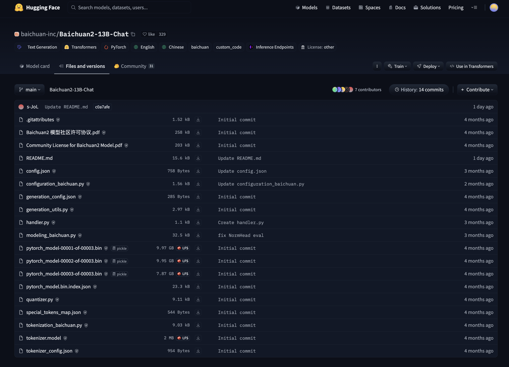
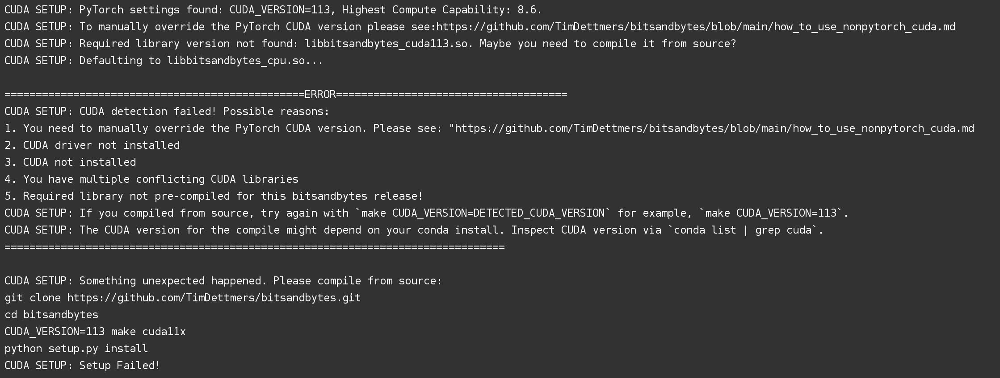
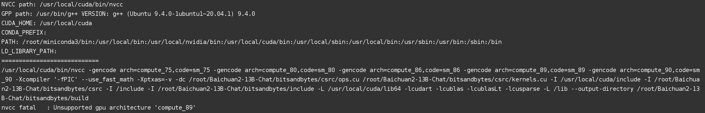
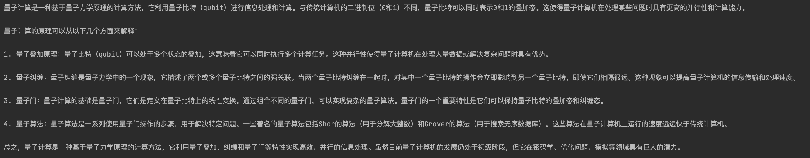
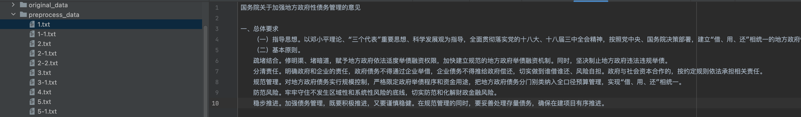
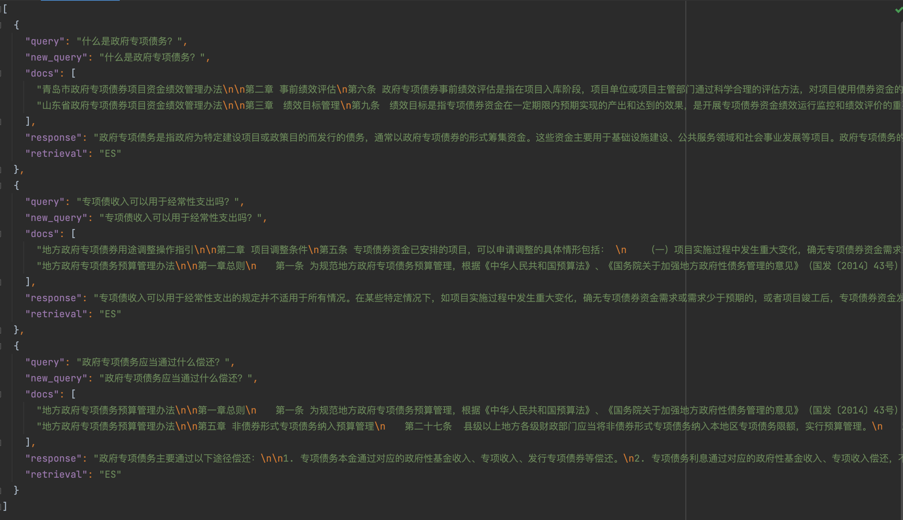

## 1. 检索增强生成

### 1.1 RAG基本介绍

开源的基座模型参数量不够大，本身拥有的能力有限。要完成复杂的知识密集型的任务，可以基于语言模型构建一个系统，通过访问外部知识源来做到。这样可以使生成的答案更可靠，有助于缓解“幻觉”问题。

RAG 会接受输入并检索出一组相关/支撑的文档，并给出文档的来源。这些文档作为上下文和输入的原始提示词组合，送给文本生成器得到最终的输出。这样 RAG 更加适应事实会随时间变化的情况，这非常有用，因为 LLM 的参数化知识是静态的，RAG 让语言模型不用重新训练就能够获取最新的信息，基于检索生成产生可靠的输出。


### 1.2 RAG基本流程

基本流程概述：用户输入问题——>问题重构（补全指代信息，保证多轮对话的能力）——>从检索库检索答案——用LLM总结答案

RAG 由两部分组成：

- 第一部分负责在知识库中，根据 query 检索出匹配的文档。
- 第二部分将 query 和文档拼接起来作为 QA 的 prompt，送入 seq2seq 模型，生成回复。


## 2. 部署大模型服务

### 2.1 大模型基座选型

选用当下效果比较好的Baichuan13B大模型，以下将会提供普通服务和流式服务两种调用方式。

- 项目地址：[https://github.com/baichuan-inc/Baichuan2](https://github.com/baichuan-inc/Baichuan2)

显存要求如下表所示，由于租用的3090显卡只有24GB显存，因此只能跑8bits量化模型。如果你的显卡资源够，可以跑全精度，代码改成model = model.cuda()

| Precision   | Baichuan2-7B | Baichuan2-13B |
| ----------- | ------------ | ------------- |
| bf16 / fp16 | 15.3         | 27.5          |
| 8bits       | 8.0          | 16.1          |
| 4bits       | 5.1          | 8.6           |

### 2.2 准备部署代码

#### 2.2.1 普通服务的代码

baichuan_api_server.py

```python
# -*- coding: utf-8 -*-

from flask import Flask, request
from flask_cors import cross_origin
import json
import torch
from transformers import AutoModelForCausalLM, AutoTokenizer
from transformers.generation.utils import GenerationConfig
import datetime

model_path = '/Path/Baichuan2-13B-Chat'
model = AutoModelForCausalLM.from_pretrained(model_path, torch_dtype=torch.float16,
                                             trust_remote_code=True)
torch.cuda.set_device(0)  # 指定显卡
# model = model.cuda()
model = model.quantize(8).cuda()
model.generation_config = GenerationConfig.from_pretrained(
    model_path
)
tokenizer = AutoTokenizer.from_pretrained(
    model_path,
    use_fast=False,
    trust_remote_code=True
)
model.eval()

app = Flask(__name__)


@app.route('/', methods=['POST'])
@cross_origin()
def batch_chat():
    global model, tokenizer

    data = json.loads(request.get_data())
    now = datetime.datetime.now()
    time_format = now.strftime("%Y-%m-%d %H:%M:%S")
    try:
        messages = data.get("messages")
        response = model.chat(tokenizer, messages)
        answer = {"response": response, "history": [], "status": 200, "time": time_format}
        return answer
    except Exception as e:
        return {"response": f"大模型预测出错:{repr(e)}", "history": [('', '')], "status": 444, "time": time_format}


if __name__ == '__main__':
    with torch.no_grad():
        app.run(host='0.0.0.0', port=1707)
```

后台启动服务：

```
$ nohup python3 baichuan_api_server.py > baichuan_api_server.log 2>&1 &           
```

#### 2.2.2 流式服务的代码

baichuan_stream_api_server.py

```python
# -*- coding: utf-8 -*-

import argparse
from flask import Flask, request, Response
from flask_cors import cross_origin
import json
import torch
from transformers import AutoModelForCausalLM, AutoTokenizer
from transformers.generation.utils import GenerationConfig

model_path = '/Path/Baichuan2-13B-Chat'
model = AutoModelForCausalLM.from_pretrained(model_path, torch_dtype=torch.float16, device_map="auto",
                                             trust_remote_code=True)
torch.cuda.set_device(0)  # 指定显卡
# model = model.cuda()
model = model.quantize(8).cuda()
model.generation_config = GenerationConfig.from_pretrained(
    model_path
)
tokenizer = AutoTokenizer.from_pretrained(
    model_path,
    use_fast=False,
    trust_remote_code=True
)
model.eval()

app = Flask(__name__)


def solve(messages):
    position = 0
    for response in model.chat(tokenizer, messages, stream=True):
        chunk = response[position:]
        yield chunk
        position = len(response)


@app.route('/', methods=['POST'])
@cross_origin()
def batch_chat():
    global model, tokenizer

    data = json.loads(request.get_data())
    messages = data.get("messages")
    return Response(solve(messages), content_type='text/plain; charset=utf-8')


parser = argparse.ArgumentParser(description='')
parser.add_argument('--port', default=1708, type=int, help='服务端口')
args = parser.parse_args()

if __name__ == '__main__':
    with torch.no_grad():
        app.run(host='0.0.0.0', port=args.port)
```

后台启动服务：

```
$ nohup python3 baichuan_stream_api_server.py > baichuan_stream_api_server.log 2>&1 & 
```

### 2.3 下载模型并安装依赖

#### 2.3.1 下载模型文件

模型地址：[https://huggingface.co/baichuan-inc/Baichuan2-13B-Chat/tree/main](https://huggingface.co/baichuan-inc/Baichuan2-13B-Chat/tree/main)



注：如果没有梯子，也可以用国内镜像站去下载模型，[https://aifasthub.com/models](https://aifasthub.com/models)

可以使用 HuggingFace Hub 下载模型文件，首先，我们需要安装huggingface_hub依赖。

```
$ pip3 install huggingface_hub
```

之后执行该脚本即可。

```python
# -*- coding: utf-8 -*-

import os
from huggingface_hub import snapshot_download

# 模型仓库的标识
repo_id = "baichuan-inc/Baichuan2-13B-Chat"

# 下载模型到指定目录
local_dir = "./{}".format(repo_id)

# 检查目录是否存在，如果不存在则创建
if not os.path.exists(local_dir):
    os.makedirs(local_dir)

snapshot_download(repo_id=repo_id, local_dir=local_dir)
```

#### 2.3.2 安装依赖环境

torch环境使用服务器镜像自带的（没有的话 pip3 install torch 安装一下）。依赖安装的坑比较多，主要是CUDA环境不匹配的问题。

```
$ pip3 install flask 
$ pip3 install flask_cors
$ pip3 install accelerate 
$ pip3 install sentencepiece
$ pip3 install scipy
$ pip3 install transformers==4.33.2  
$ pip3 install xformers

$ git clone https://github.com/TimDettmers/bitsandbytes.git
$ cd bitsandbytes
$ vim Makefile
# CC_ADA_HOPPER := -gencode arch=compute_89,code=sm_89
# CC_ADA_HOPPER += -gencode arch=compute_90,code=sm_90
$ CUDA_VERSION=121 make cuda12x
$ python3 setup.py install
```

踩过的坑：

[1] transformers 安装问题

一开始直接使用 pip3 install transformers  去安装，但出现了 AttributeError: 'BaichuanTokenizer' object has no attribute 'sp_model' 的问题。检查模型文件下载全了，查阅资料得知 pip3 install transformers==4.33.2 版本可解决此问题。

安装完之后，执行时又卡在 Xformers is not installed correctly. If you want to use memory_efficient_attention to accelerate training use the following command to install Xformers，之后又执行 pip3 install xformers 安装该依赖，解决了该问题。

[2] bitsandbytes安装问题

bitsandbytes是用于大模型量化的库，项目地址：[https://github.com/TimDettmers/bitsandbytes](https://github.com/TimDettmers/bitsandbytes)

一开始直接使用 pip3 install bitsandbytes 去安装，但出现了与CUDA不兼容的问题。（该问题不一定会出现，优先使用pip3去安装，不行的话再考虑编译安装）



然后我又使用了编译安装的方式，又出现 Unsupported gpu architecture 'compute_89' 的问题。



使用  nvcc --list-gpu-arch 命令查询，发现只支持到 compute_86。因此修改 Makefile，将compute_89和compute_90的都注释掉，然后重新进行编译即可。

### 2.4 使用大模型服务

#### 2.4.1 使用普通服务

baichuan_api_test.py

```python
# -*- coding: utf-8 -*-


import requests
import json


class Baichuan:
    def __init__(self, url):
        self.url = url

    def __call__(self, messages: list) -> str:
        data = {"messages": messages}
        response = requests.post(self.url, json=data)
        response = json.loads(response.content)
        return response["response"]


if __name__ == '__main__':
    llm = Baichuan("http://127.0.0.1:1707/")
    messages = [{
        "role": "user",
        "content": "解释一下量子计算"
    }]
    response = llm(messages)
    print(response)
```

#### 2.4.2 使用流式服务

baichuan_stream_api_test.py

```python
# -*- coding: utf-8 -*-

import requests
import json


class Baichuan:
    def __init__(self, url):
        self.url = url

    def stream_request(self, messages: list):
        data = json.dumps({"messages": messages})
        try:
            with requests.post(self.url, data=data, headers={'Content-Type': 'application/json'}, stream=True) as response:
                response.raise_for_status()
                for line in response.iter_lines():
                    if line:
                        decoded_chunk = line.decode('utf-8')
                        yield decoded_chunk
        except requests.RequestException as e:
            print(f"请求错误: {e}")


if __name__ == '__main__':
    llm = Baichuan("http://127.0.0.1:1708")
    messages = [{
        "role": "user",
        "content": "解释一下量子计算"
    }]
    for response in llm.stream_request(messages):
        print(response)
```

注：使用流式服务，可以让结果随着推理过程，一点儿一点儿的往外输出，用户体验更好，但使用流式服务会比普通服务更耗资源。

#### 2.4.3 运行出的效果

以下是 Baichuan2-13B-Chat 模型在 8bits 量化的运行效果。



### 2.5 对服务进行压力测试

实验环境：单卡 NVIDIA A40 / 48GB，跑的全精度 Baichuan2-13B-Chat 模型，使用如下脚本对普通服务进行压测。

```python
# -*- coding: utf-8 -*-

from typing import Union, Any, List, Tuple
import requests
import json
import threading
import time


class Baichuan:
    def __init__(self, url):
        self.url = url

    def send_request(self, messages: List[dict]) -> Tuple[bool, Union[str, Any], float]:
        start_time = time.time()
        try:
            data = {"messages": messages}
            response = requests.post(self.url, json=data)
            response = json.loads(response.content)
            success = True
        except Exception as e:
            response = str(e)
            success = False
        end_time = time.time()
        return success, response, end_time - start_time


def worker(url, messages, index, stats):
    bc = Baichuan(url)
    success, response, duration = bc.send_request(messages)
    with stats['lock']:
        if success:
            stats['success_count'] += 1
        else:
            stats['failure_count'] += 1

        stats['total_duration'] += duration
        if duration < stats['min_duration']:
            stats['min_duration'] = duration
        if duration > stats['max_duration']:
            stats['max_duration'] = duration

    print(f"Thread {index}: {'Success' if success else 'Failure'}, Response: {response}, Duration: {duration}s")


if __name__ == '__main__':
    url = "http://127.0.0.1:1707/"
    messages = [{
        "role": "user",
        "content": "解释一下量子计算"
    }]

    num_threads = 10  # 测试并发线程数
    num_rounds = 3  # 测试轮数

    stats = {
        'success_count': 0,
        'failure_count': 0,
        'total_duration': 0.0,
        'min_duration': float('inf'),
        'max_duration': float('-inf'),
        'lock': threading.Lock()
    }

    for round in range(num_rounds):
        print(f"开始测试轮数: {round + 1}")
        threads = []

        for i in range(num_threads):
            thread = threading.Thread(target=worker, args=(url, messages, i, stats))
            threads.append(thread)
            thread.start()

        for thread in threads:
            thread.join()

    # 输出总体统计结果
    avg_duration = stats['total_duration'] / (num_threads * num_rounds) if num_threads > 0 else 0
    print(f"总成功次数: {stats['success_count']}, 总失败次数: {stats['failure_count']}")
    print(f"整体最短耗时: {stats['min_duration']:.2f}s, 整体最长耗时: {stats['max_duration']:.2f}s, 整体平均耗时: {avg_duration:.2f}s")
```

测试效果：1线程平均耗时16.32s，3线程平均耗时49.21s，5线程平均耗时82.62s，10线程平均耗时172.23s。它是可以扛住少量并发的，但开多线程并不能提高处理效率。如果出现少量并发都出现大模型预测出错问题，那说明是显卡不行（比如3090、A6000），跟代码无关，可以考虑Nginx负载均衡，详见我的另外一篇博客：[Docker容器化及项目环境管理](https://www.eula.club/blogs/Docker容器化及项目环境管理.html)


## 3. 检索增强大模型生成实例

### 3.1 实例场景概述

需求场景：有一批内部的政府政策文档，数据不可外传，只能使用自托管大模型来实现，需要基于这些文档进行垂直领域的问答。

数据预处理：提供的文档主要是Word、PDF等格式，无法直接使用，需要将数据预处理再入检索库，这里是处理成txt格式了。



数据预处理要求：数据量少的话，可以人工去做，做的方法是每个文档拆开，拆开后每个数据是：“文档标题+文档中的某一段”，目的是保证每条数据都有较完整的语义，并且长度不会太长（1000个token以内最好，当然肯定是越短越好，会更加准确）。

注意：本项目由于数据不便于公开，所以用于构建检索库的数据文件我删掉了，使用时需要自己去补全。

### 3.2 构建ES检索库

#### 3.2.1 搭建ES环境并安装ik分词器

Step1：搭建Docker环境

```
$ apt-get update -y && apt-get install curl -y  # 安装curl
$ curl https://get.docker.com | sh -   # 安装docker
$ sudo systemctl start docker  # 启动docker服务（改成restart即为重启服务）
$ docker version # 查看docker版本（客户端要与服务端一致）
```

Step2：使用Docker搭建ElasticSearch

```
$ docker pull elasticsearch:7.16.2
$ docker run -d --name es \
-p 9200:9200 -p 9300:9300 \
-e "discovery.type=single-node" -e ES_JAVA_OPTS="-Xms1g -Xmx1g" \
elasticsearch:7.16.2
$ docker update es --restart=always
```

Step3：进入容器给ElasticSearch配置密码

```
$ docker exec -it es /bin/bash 
$ cd config
$ chmod o+w elasticsearch.yml
$ vi elasticsearch.yml
```

其中，在 elasticsearch.yml 文件的末尾添加以下配置，代表开启xpack安全认证）

```
xpack.security.enabled: true    
```

然后把权限修改回来，重启容器，设置账号密码，浏览器访问`http://IP:9200`地址即可（用 elastic账号 和自己设置的密码登录即可）

```
$ chmod o-w elasticsearch.yml
$ exit
$ docker restart es
$ docker exec -it es /bin/bash 
$ ./bin/elasticsearch-setup-passwords interactive   // 然后设置一大堆账号密码
```

Step4：安装ik分词器插件

```
$ docker exec -it es /bin/bash
$ apt-get install -y wget   
$ wget https://github.com/medcl/elasticsearch-analysis-ik/releases/download/v7.16.2/elasticsearch-analysis-ik-7.16.2.zip
$ unzip -o -d /usr/share/elasticsearch/elasticsearch-analysis-ik-7.16.2 /usr/share/elasticsearch/elasticsearch-analysis-ik-7.16.2.zip
$ rm –f elasticsearch-analysis-ik-7.16.2.zip
$ mv /usr/share/elasticsearch/elasticsearch-analysis-ik-7.16.2 /usr/share/elasticsearch/plugins/ik
$ cd /usr/share/elasticsearch/bin
$ elasticsearch-plugin list
$ exit
$ docker restart es
```

#### 3.2.2 构建ES索引并写入数据

安装 elasticsearch 依赖

```
$ pip3 install elasticsearch
```

es_index.py

```python
# -*- coding: utf-8 -*-

import os
from elasticsearch import Elasticsearch
from elasticsearch import helpers

index_name = "audit_qa"
es = Elasticsearch(
    hosts=["http://127.0.0.1:9200"],
    basic_auth=("elastic", "your_password"),
    request_timeout=60
)
CREATE_BODY = {
    "settings": {
        "number_of_replicas": 0
    },
    "mappings": {
        "properties": {
            "content": {
                "type": "text",
                "analyzer": "ik_max_word"
            }
        }
    }
}

es.indices.create(index=index_name, body=CREATE_BODY)
directory_path = "./preprocess_data"
contents = []

# 遍历目录下的文件
for filename in os.listdir(directory_path):
    # 确保文件是以txt为扩展名的文本文件
    if filename.endswith(".txt"):
        file_path = os.path.join(directory_path, filename)
        # 读取文件内容并添加到列表中
        with open(file_path, 'r', encoding='utf-8') as file:
            file_content = file.read()
            contents.append(file_content)

action = (
    {
        "_index": index_name,
        "_type": "_doc",
        "_id": i,
        "_source": {
            "content": contents[i]
        }
    } for i in range(0, len(contents))
)
helpers.bulk(es, action)

print("export es finish")
```

执行该文件，将预处理的数据导入ES索引库。


#### 3.2.3 构建ES文档检索服务

es_search.py

```python
# -*- coding: utf-8 -*-

import json
from flask import Flask, request
from flask_cors import cross_origin
from elasticsearch import Elasticsearch

index_name = "policy_qa"
es = Elasticsearch(
    hosts=["http://127.0.0.1:9200"],
    basic_auth=("elastic", "your_password"),
    request_timeout=60
)

app = Flask(__name__)


@app.route('/', methods=['POST'])
@cross_origin()
def retrieval():
    data = json.loads(request.get_data())
    question = data.get("question")
    top_k = data.get("top_k")
    query_body = {
        "query": {
            "match": {
                "content": question
            }
        },
        "size": top_k
    }
    res = es.search(index=index_name, body=query_body)
    docs = []
    for hit in res['hits']['hits']:
        docs.append(hit["_source"]["content"])
    return {"docs": docs}


if __name__ == '__main__':
    app.run(host='0.0.0.0', port=1709)
```

启动ES检索服务，下面会用到。

### 3.3 基于ES检索增强生成回答

solve.py

```python
# -*- coding: utf-8 -*-

import os
import requests
import json

# Global Parameters
RETRIEVAL_TOP_K = 2
LLM_HISTORY_LEN = 30


class Baichuan:
    def __init__(self, url):
        self.url = url

    def __call__(self, messages: list) -> str:
        data = {"messages": messages}
        response = requests.post(self.url, json=data)
        response = json.loads(response.content)
        return response["response"]


def init_cfg(url_llm):
    global llm
    llm = Baichuan(url=url_llm)


def get_docs(question: str, url: str, top_k=RETRIEVAL_TOP_K):
    data = {"question": question, "top_k": top_k}
    docs = requests.post(url, json=data)
    docs = json.loads(docs.content)
    return docs["docs"]


def get_knowledge_based_answer(query, history_obj, url_retrieval):
    global llm, RETRIEVAL_TOP_K

    if len(history_obj.history) > LLM_HISTORY_LEN:
        history_obj.history = history_obj.history[-LLM_HISTORY_LEN:]

    # Rewrite question
    if len(history_obj.history):
        rewrite_question_input = history_obj.history.copy()
        rewrite_question_input.append(
            {
                "role": "user",
                "content": f"""请基于对话历史，对后续问题进行补全重构，如果后续问题与历史相关，你必须结合语境将代词替换为相应的指代内容，让它的提问更加明确；否则直接返回原始的后续问题。
                注意：请不要对后续问题做任何回答和解释。
                
                后续问题：{query}
                
                修改后的后续问题："""
            }
        )
        new_query = llm(rewrite_question_input)
    else:
        new_query = query

    # 获取相关文档
    docs = get_docs(new_query, url_retrieval, RETRIEVAL_TOP_K)
    doc_string = ""
    for i, doc in enumerate(docs):
        doc_string = doc_string + doc + "\n"
    history_obj.history.append(
        {
            "role": "user",
            "content": f"请基于参考，回答问题，并给出参考依据：\n问题：\n{query}\n参考：\n{doc_string}\n答案："
        }
    )

    # 调用大模型获取回复
    response = llm(history_obj.history)

    # 修改history，将之前的参考资料从history删除，避免history太长
    history_obj.history[-1] = {"role": "user", "content": query}
    history_obj.history.append({"role": "assistant", "content": response})

    # 检查history.json是否存在，如果不存在则创建
    if not os.path.exists("./history.json"):
        with open("./history.json", "w", encoding="utf-8") as file:
            json.dump([], file, ensure_ascii=False, indent=2)

    # 读取现有数据，追加新数据，并写回文件
    with open("./history.json", "r", encoding="utf-8") as file:
        data = json.load(file)
    data.append({"query": query, "new_query": new_query, "docs": docs, "response": response,
                 "retrieval": "ES"})
    with open("./history.json", "w", encoding="utf-8") as file:
        json.dump(data, file, ensure_ascii=False, indent=2)

    return {"response": response, "docs": docs}
```

server.py

```python
# -*- coding: utf-8 -*-

from flask import Flask, request
from flask_cors import cross_origin
import time
from solve import *

app = Flask(__name__)


class History:
    def __init__(self):
        self.history = []


session_histories = {}


@app.route("/get_bot_response", methods=["POST"])
@cross_origin()
def get_bot_response():
    global session_histories
    data = json.loads(request.get_data())
    userText = data["content"]  # 用户输入
    session_id = data["id"]  # 用户id，用于保存对话历史

    # 获取对话历史，如果有的话
    if session_id in session_histories:
        history_obj = session_histories[session_id]["history"]
        session_histories[session_id]["last_access_time"] = time.time()
    else:
        history_obj = History()
        session_histories[session_id] = {
            "history": history_obj,
            "last_access_time": time.time(),
        }

    # 如果用户超过一个小时没有交互，则删除该用户的对话历史
    max_idle_time = 60 * 60
    for session_id, session_data in session_histories.copy().items():
        idle_time = time.time() - session_data["last_access_time"]
        if idle_time > max_idle_time:
            del session_histories[session_id]

    if userText == "清空对话历史":
        history_obj.history = []
        return str("已清空")

    response = get_knowledge_based_answer(
        query=userText, history_obj=history_obj, url_retrieval="http://127.0.0.1:1709/"
    )
    return response


if __name__ == "__main__":
    init_cfg("http://127.0.0.1:1707/")
    app.run(host="0.0.0.0", port=1710)
```

rag_test.py

```python
# -*- coding: utf-8 -*-

import json
import requests
import random
from tqdm import trange


if __name__ == '__main__':
    url = "http://127.0.0.1:1710/get_bot_response"
    question = ["什么是政府专项债务？", "专项债收入可以用于经常性支出吗？", "政府专项债务应当通过什么偿还？"]
    for i in trange(len(question)):
        data = {"id": random.randint(0, 9999999), "content": question[i]}
        res = requests.post(url, json=data)
        res = json.loads(res.content)
        print("\nQuestion: " + question[i])
        print("\nAnswer: " + res["response"])
        print("\n-------------------------------------------------")
```

先执行 server.py 启动 ES 检索增强大模型生成服务，再执行 rag_test.py 进行测试。输出里会有个 history.json 文件，记录中间过程及结果。



